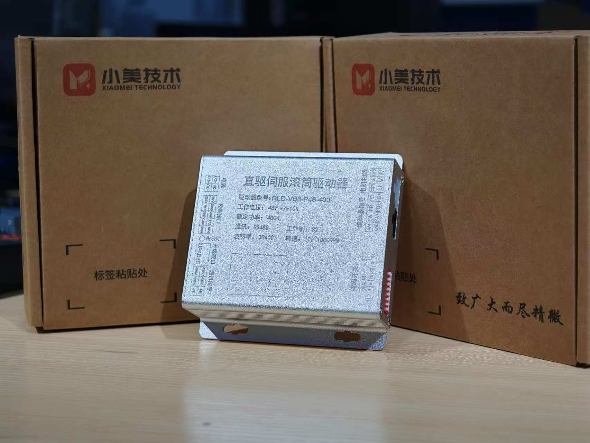

# 直驱伺服滚筒驱动器
针对电池柜项目中大规模灯珠与光电传感器的IO控制需求，我们为客户定制了模块可分离式远程I/O解决方案，采用“一拖六分布式架构”，将定制灯组传感器IO板与EtherCAT通讯接口模块分离设计，既实现了3×6路数字输出、1×6路数字输入的现场信号采集与控制，又通过背板总线支持64节点联动扩展，大幅简化了传统点对点布线的现场接线工作，显著降低了线缆与施工成本，同时方案支持快速更换与功能迭代，兼容主流PLC系统，为客户提供了一套高可靠、易维护、可扩展的低成本IO控制方案。

## 直驱伺服滚筒驱动器 PLD-V88-P48-400

### 应用
有感无刷滚筒伺服驱动器，适用于物流分拣线，物流输送线，AGV等输送场景。

### 规格介绍
- **铝合金外壳材质，增强散热**
- **电源支持 24V 200W 或者 48V 400W**
- **使用FOC算法控制，提供速度闭环、位置闭环等控制**
- **控制信号有2个信号输入，1个信号输出**
- **1路RS485接口、1路固件升级接口、无刷电机UVW端口、ABZ3相差分位置传感器接口**
- **8位拨码盘**