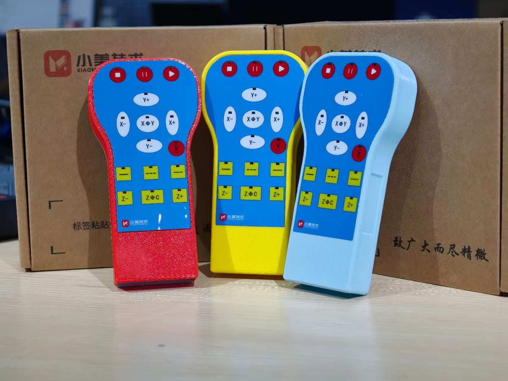

# 定制按键手轮

<model-viewer
  src="/models/wh-db15-1.glb"  
  ar ar-modes="webxr scene-viewer quick-look" 
  camera-orbit="30.85deg 80deg 1m" field-of-view="30deg" 
  alt="3D模型" 
  auto-rotate 
  camera-controls 
  exposure="0.5" 
  shadow-intensity="1" 
  environment-image="neutral" 
  tone-mapping="aces" 
  ambient-occlusion-intensity="1" 
  min-camera-distance="0.5" 
  max-camera-distance="10" 
  style="width: 100%; height: 400px;" 
></model-viewer>

## 引脚定义

| 引脚号 | 功能 / 信号名 | 引脚号 | 功能 / 信号名 |
| :---: | :--- | :--- | :--- |
| 1 | Y+ | 9 | F9 |
| 2 | Y- | 10 | COM |
| 3 | X+ | 11 | J0.1 |
| 4 | X- | 12 | XY0 |
| 5 | Z+ | 13 | SPIN |
| 6 | Z- | 14 | Z0 |
| 7 | J0.05 | 15 | F11 |
| 8 | JOG | 外壳 | NC（空脚） |

::: tip
支持定制P形，N形

支持定制引脚定义

支持定制外壳颜色
:::

## 应用场景
- 数控雕刻机、铣床的手动对刀、轮廓校验与点位微调
- 自动化生产线设备的调试、维护与故障排查
- 教学 / 实训数控设备的操作教学场景
