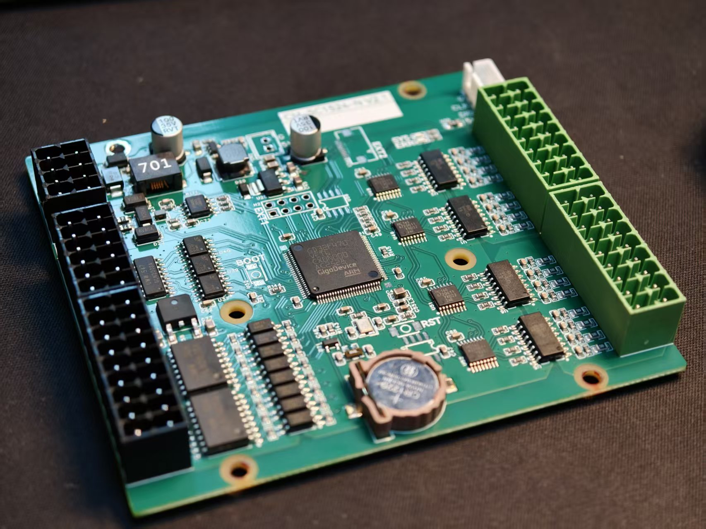
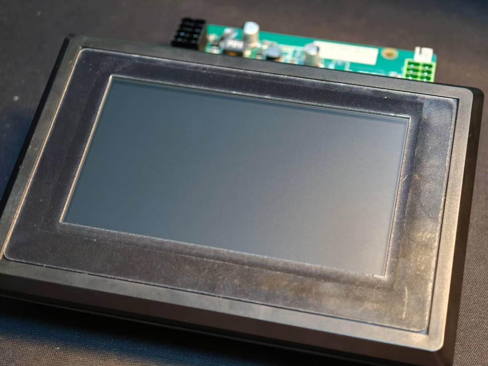

# 飞达控制器套件
CM-SC1524-N 是一款由小美技术（东莞）有限公司开发的 5 轴脉冲控制卡，属于用户定制系列。它旨在为工业自动化和过程控制应用提供高精度，低成本控制方案。套件配套TSC-4827-143R触摸显示屏。

本套件适用于各类贴标机的模切飞达，自裁自贴飞达，以及 SMT 供料飞达等设备。

## 板卡控制器 CM-SF1524-N

### 应用
专为特定飞达（Feeder）送料流程定制的 5 轴脉冲伺服控制器，内置专属控制工艺算法，稳定、精准、高效。

- **强劲算力微秒响应**：搭载工业级高性能主控，采用 Cortex-M4 内核，主频高达 240MHz，内置硬件 FPU 与 DSP。硬核算力实现微秒级控制响应，满足自动化产线严苛运行需求。
- **平稳高速零丢步**：支持 5 轴高速脉冲输出，保障物料高速启停过程平稳、无抖动、无丢步，完美匹配精密贴装等苛刻送料场景。
- **高集成与高可靠性**：集成全工业级外设，总线抗干扰能力突出。无需额外扩展即可稳定驱动多路飞达、传感器与编码器，从容应对车间复杂电磁环境。

### 规格介绍
- **工作电源**：DC 24V
- **脉冲控制**：5 轴独立脉冲 + 方向信号输出（最高 200kHz）
- **数字量 I/O**：32 路数字量输入 / 16 路数字量输出
- **通讯接口**：1 路 RS232（常用于对接触摸屏），1 路 RS485
- **其他功能**：支持 RTC 实时时钟 

## 触摸显示屏 TSC-4827-143R

### 应用
为用户定制的飞达控制器专用触摸显示屏，用以显示设备信息并调节设备参数。

### 规格介绍
- **电源 工作电压 24V 支持电压范围 9~28V**  
- **1 路 RS485 通信 支持 255 节点** 
- **1 路 RS232 通信** 
- **屏幕尺寸 4.3 寸** 
- **屏幕分辨率 480x270 PPI**
- **触摸样式 电阻触摸屏 单点触摸**

