# 飞达控制器操作手册

<!-- ## 硬件连接
//todo
32142125513531513531531531513
测试diff功能 -->

## 屏幕交互
### (一) 调试操作
#### 0. 权限与密码
A. 点击左下角操作员/工程师/管理员按键进入登陆页面
B. 权限和密码
- 操作员：111
- 工程师：333
- 管理员：666
C. 修改系统参数和电机参数需要管理员权限，一般直接登录管理员权限即可

#### 1. 第一次调试（上电）
A. 首先确认飞达类型-模切和自裁自切，在主页面左下角确认当前飞达类型。如若不同，在参数0页面中飞达类型修改为对应类型，然后点击参数0页面左下角的重启按键，回到主页面等待10秒左右，待到页面左下角飞达类型变为对应类型。
- 单独调试飞达时，可以屏蔽安全信号，在参数2中修改
- 默认为模切类型，所以一般只有自裁自切类型需要重新设置
- 如果超过20s，设备类型无变化，可重复上述2-3次

B. 在未确认IO状态和电机状态时，不要直接初始化，先手动测试电机动作和每个IO点的状态是否正确，特别是推进电机的前后限位
- 推进电机如果在后限位，电机无法自主运动，需要失能后手动推到正常位置

C. 电机和气缸可手动操作确认是否有报警触发
- 未初始化时设置的电机速度和定位参数无法掉电保存

#### 2. 日常调试
A. 一般调试需要初始化完成后，在运行中状态下，点击停止和断开按钮，使设备处于单机手动状态，然后调试操作可参考后面(四)手动操作章节
B.如果初始化有问题，可以点击设置0页面的重启按键，等待5-10秒后，按照第一次调试的指导进行调试

#### 3. 电机拨码
- 模切：sw1-sw5全为off
- 自裁切：sw4为on，其他全为off

---

### (二) 初始化
A. 检查所有IO和电机状态，直接点击初始化按键，电机先后退一定距离，然后向前找零点
B. 初始化的时候，一定不要点击其他按键，防止初始化进程被打断
C. 如果一直卡在初始化状态，点击参数0页面中的重启按键，然后检查推进电机和限位，确认无误后重新初始化

---

### (三) 参数设置
#### 1. 系统参数（修改即保存）
a. 出料/收料超时时间
- 最小值：2000ms；最大值：30000ms
- 出料/收料电机单次运行最大时间
- ps:与出料/收料电机速度共同影响出料/收料效率

b. 寻标超时时间(模切飞达参数)
- 最小值：2000ms；最大值：30000ms
- 寻标单次运行最大时间
- ps:与推进电机速度共同影响寻标流程

c. 气缸超时时间
- 最小值：1000ms；最大值：3000ms
- 所有气缸输出状态和限位开关状态不一致最大时间

d. 飞达类型
- 0-模切；1-自裁自切

e. 电机报警状态
- 0-常开；1-常闭
- 默认常闭

f. 招标方式(模切飞达参数)
- 0-上升沿；1-下降沿
- 寻标时是检查信号上升沿还是下降沿

g. 回收2电机启用
- 0-屏蔽；1-启用
- 回收2电机是否启用，修改后不会立即生效，需要重新上电或者点击参数0页面中的重启按键
- 现阶段，只有模切需要启用回收2电机启用

h. 安全信号(掉电不保存)
- 0-启用；1-屏蔽
- 主要用于调试时，每次重新上电或者重启都会恢复为0-启用

j. 自动回零参数
- 最小值：1；最大值：10000
- 每运行x次后，飞达自动回零一次

#### 2. 电机参数（手动保存）
##### a. 修改参数流程
- 点击主页面中的停止按键，然后系统处于停止状态
- 点击主页面断开按键，联机状态变为断开，自动变为手动
- 然后可以修改相关电机参数，修改完成重新初始化
- 初始化完成后，参数设置并保存成功

##### b. 参数设置推荐
**A.模切飞达**
- 送膜电机速度：5
- 回收1电机速度：5
- 回收2电机速度：5
- 推进电机速度：10
- 推进电机退后位：-100
- 推进电机前进位：-90

**B.自裁自切飞达**
- 送膜电机速度：5
- 回收1电机速度：3
- 推进电机速度：15
- 推进电机退后位：25
- 推进电机前进位：-2

---

### (四) 手动操作
#### 1. 手动出标
A.系统处于运行中状态，点击主页面断开按键，联机状态为0
B.然后点击主页面中的请求出胶和请求脱(切)胶按键手动控制流程

#### 2. 手动控制
A.初始化完成后，在运行中状态下，点击停止和断开按钮，使设备处于单机手动状态
B.然后可以进入手动控制页面进行操作，如果需要修改参数，需要登陆管理员权限

---

### (五) 自动控制
A.系统初始化完成后，系统直接进入联机自动状态，可以直接与PLC通信进行控制
- 如果手动控制正常，无法进行自动控制，请检查通信信号

---

### (六) 页面介绍
1. 主页面
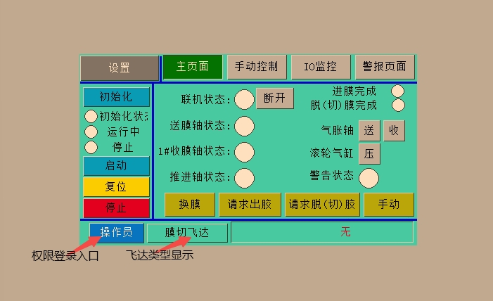
2. 权限登录
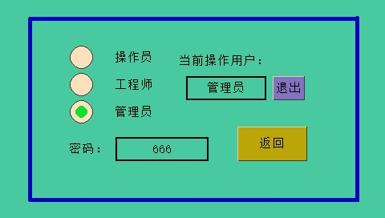
3. 设置
a. 参数0
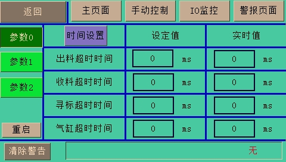
b. 参数1
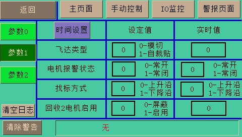
c. 参数2
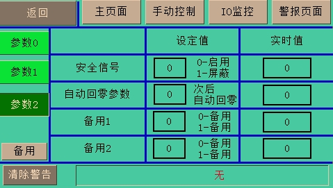
4. 手动控制
a. 送膜电机
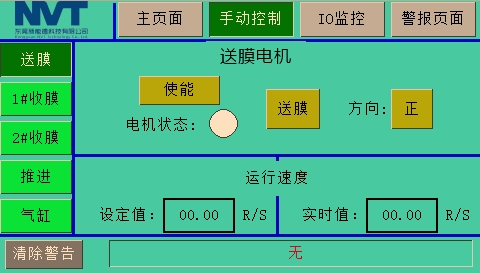
b. 1#收膜电机
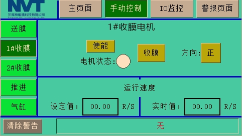
c. 2#收膜电机
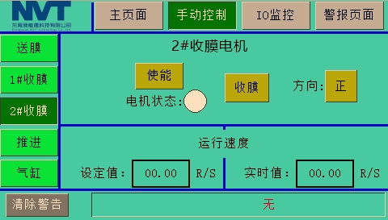
d. 推进电机
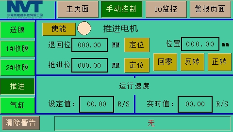
e. 气缸
Ⅰ.第一页
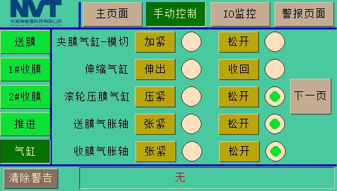
Ⅱ.第二页
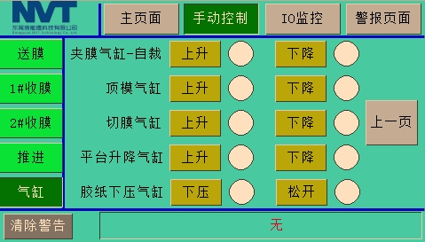
5. IO监控
a. 输入0
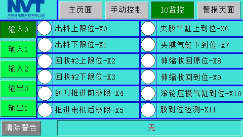
b. 输入1
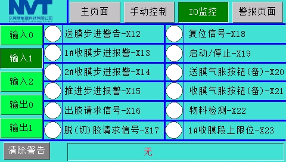
c. 输入2
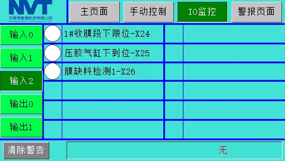
d. 输出0
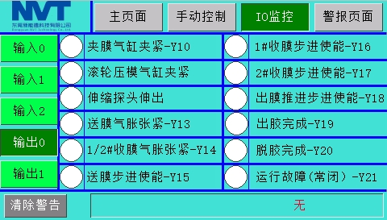
e. 输出1
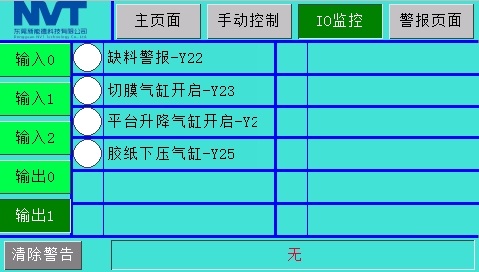
6. 警报页面
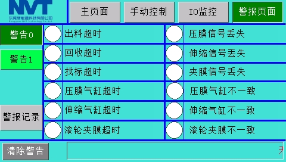

---

## 常见问题（保持更新）
### 1. 卡在初始化状态
a. 页面显示
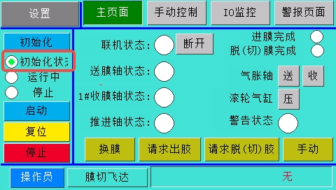
b. 解决方法
1. 首先确认是否有警报，有警报先分析警报并解决。（复位按键和清楚警报按键都能清除当前警报）
2. 没有警报确认步进电机和限位是否正常
    1. 模切飞达:前限位信号常闭，后限位信号常闭
    2. 自裁自切飞达:前限位信号常闭，后限位信号常开
    3. 电机初始化时先后退再前进，碰到前限位停止
3. 如果初始化卡住，初始化状态/运行中/停止 都没有绿点，再次点击初始化
4. 如果步进电机在初始化状态时没有动作，可以点击设置参数0页面的重启按键，等待5秒后再尝试初始化
5. 如若重启不行，再尝试直接整体断电再重新上电

### 2. 推进电机相关
a. 页面显示
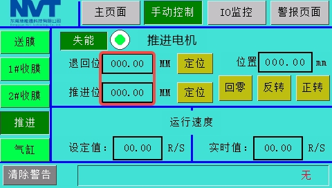
- 参数设置可以查看 (三)参数设置/1.系统参数/b.参数设置推荐
- 回零按键已被屏蔽，防止其他机构发生干涉，需要回零使用主页面初始化按键，保证机构安全

b. 模切飞达
- 推进电机初始化回零之后，前进为正数，后退为负数
- 一般情况下，退后位和推进位都应该设置为负数

c. 自裁自切飞达
- 自裁自切飞达相反，初始化回零之后，前进为负数，后退为正数
- 一般情况下，退后位设置为正数，推进位设置为负数

### 3. 气缸报警
a. 页面显示
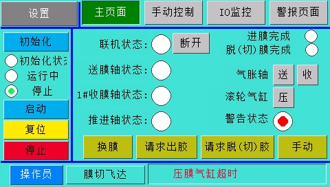
b. 解决方法
1. 首先检查对应气缸的限位开关状态变化是否正确(切换到手动控制进行测试)
2. 观察对应气缸的限位开关状态变化是否在1s-3s之内(气缸超时时间，在设置参数0页面中设置)
3. 修改气缸超时时间或者修复气缸问题，然后清除警告或者复位
4. 如果复位或者清除警告无效，可进入设置参数0页面点击重启，重新初始化

### 4. 电机报警
a. 页面显示
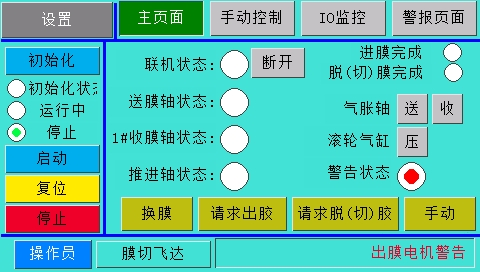
b. 解决方法
- 点击设置参数0页面的重启按键，等待5秒后再尝试初始化，同时观察是否有电机警报
- 如若重启不行，再尝试直接整体断电再重新上电尝试
- 如果所有电机同时报警（回收2电机不启用始终不会报警），极大可能是电机报警状态设置不对，在设置中修改常闭常开设置

### 5. 电机方向翻转
- 如果需要翻转电机方向，比如出料电机和收料电机
- 直接修改对应电机的拨码开关，SW1控制电机方向，将其调整状态即可翻转电机运动方向

### 6. 安全信号报警
- 安全信号本质是启停信号（启动/停止），其作用是
- 在模切上，防止手动误操作伸缩气缸伸出损坏取料机构
- 在自裁切上，防止切刀气缸非预期动作损坏取料机构
- 调试阶段可以在设置2里面屏蔽安全性信号
- 实际生产中不使用该信号，可以直接让这个输入始终置1，尽量使用该信号控制（特别是自裁切，风险更高）

---

## 问题在线收集
1. 问题1
问题描述：

2. 问题2
问题描述：

3. 问题3
问题描述：

## 联系方式