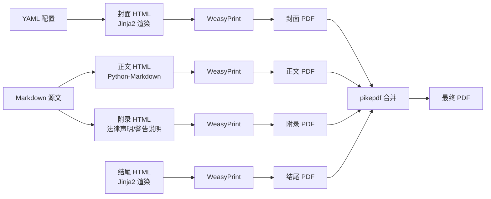
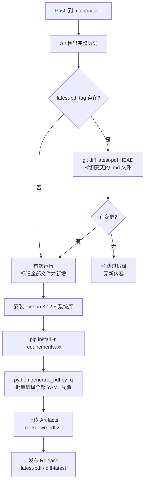

# PDF 编译指南

本文档介绍如何使用项目内置的 Python PDF 流水线，从 Markdown 源文件编译为印刷级 PDF，覆盖本地编译和 GitHub Actions 自动发布全流程。

## 架构概览

项目包含两套独立系统：VitePress 负责网页，Python 流水线负责 PDF。两者共享 `markdown/` 源文件，但编译链路完全独立。



| 组件 | 目录 | 说明 |
|------|------|------|
| 封面模板 | `pdf-templates/covers/` | Jinja2 HTML，变量来自 YAML 配置 |
| 结尾模板 | `pdf-templates/endings/` | Jinja2 HTML，通常为空白结尾页 |
| Markdown 源文 | `markdown/` | 与 VitePress 网站共用 |
| 附录资源 | `pdf-content/` | 法律声明（`legal-info.md`）、警告标识说明（`warning-meanings.md`） |
| PDF 配置 | `pdf-configs/` | 每个 PDF 一个 `.yaml` 文件 |
| 编译脚本 | `scripts/generate_pdf.py` | Python，入口文件 |

---

## YAML 配置详解

每个 PDF 对应一个 YAML 配置文件，存放在 `pdf-configs/` 目录下。以下是完整字段说明：

```yaml
# ========== 基本信息 ==========
company: 小美技术（东莞）有限公司       # 公司中文名（封面/页眉使用）
company_en: Xiaomei Technology ...     # 公司英文名（封面/页脚使用）
brand: "#dc2626"                       # 品牌色（封面等模板使用）

title: 数据手册                         # 文档标题（封面/页眉）
subtitle: DATASHEET                    # 英文副标题（封面）
series: Pexus Edge 远程IO               # 产品系列名（封面）
description: 技术规格与参数说明           # 文档描述（封面）

# ========== 封面模板 ==========
cover:
  template: pdf-templates/covers/cover-datasheet.html  # 模板路径
  variables:                            # 自定义模板变量（可选，可在模板中直接引用）
    doc_number: DOC-IM2610C-001        # 文档编号，模板中用 {{ doc_number }}
    version: V1.0                       # 版本号，模板中用 {{ version }}
    order_number: IM2610C               # 订购号，模板中用 {{ order_number }}

# ========== 结尾模板 ==========
ending:
  template: pdf-templates/endings/ending-default.html

# ========== 正文内容 ==========
content:
  base_dir: markdown                    # Markdown 源文件根目录（相对于项目根）
  files:                                # 要包含的文件/目录列表（按顺序拼接）
    - pexus/edge/EtherCAT/IM2610C-datasheet.md   # 单个 .md 文件
    # - pexus/edge/EtherCAT/               # 整个目录（递归包含所有 .md）
    # - pexus/edge/*/index.md              # 通配符匹配

# ========== 附录（可选） ==========
appendices:
  - pdf-content/legal-info.md           # 法律声明（知识产权、免责）
  - pdf-content/warning-meanings.md     # 安全警告标识说明

# ========== PDF 页面设置 ==========
pdf:
  format: A4                            # 纸张：A4 / Letter
  margin:                               # 页边距（单位：mm）
    top: 94                             #   上边距（含页眉空间）
    right: 57                           #   右边距
    bottom: 94                          #   下边距（含页脚空间）
    left: 57                            #   左边距
  font_family: "HarmonyOS Sans SC, SimHei, sans-serif"  # 正文字体栈
  font_dir: docs/public/fonts           # 字体文件目录
  header:                               # 页眉（每页顶部重复）
    left: 小美技术（东莞）有限公司        #   左对齐文本
    right: IM2610C 数据手册              #   右对齐文本
  footer:                               # 页脚（每页底部重复）
    left: "© 2026 Xiaomei Technology ..."

# ========== 输出路径 ==========
output: pdf-out/IM2610C-datasheet.pdf   # 相对于项目根目录
```

### content.files 三种写法

| 写法 | 示例 | 效果 |
|------|------|------|
| **单文件** | `- pexus/edge/EtherCAT/datasheet.md` | 只包含这一个文件 |
| **目录** | `- pexus/edge/` | 递归包含该目录下所有 `.md` 文件（按字母序） |
| **通配符** | `- pexus/edge/*/index.md` | 匹配所有子目录下的 `index.md` |

目录模式下，Python 脚本会自动扫描所有 `.md` 文件并排除 `pdf-content/` 目录。

### 模板变量

封面/结尾模板使用 Jinja2 语法，可用的内置变量：

| 变量 | 来源 | 示例值 |
|------|------|--------|
| `{{ COMPANY }}` | `company` 字段 | 小美技术（东莞）有限公司 |
| `{{ COMPANY_EN }}` | `company_en` 字段 | Xiaomei Technology ... |
| `{{ BRAND }}` | `brand` 字段 | #dc2626 |
| `{{ TITLE }}` | `title` 字段 | 数据手册 |
| `{{ SUBTITLE }}` | `subtitle` 字段 | DATASHEET |
| `{{ SERIES }}` | `series` 字段 | Pexus Edge 远程IO |
| `{{ DESCRIPTION }}` | `description` 字段 | 技术规格与参数说明 |
| `{{ YEAR }}` | 当前系统日期 | 2026 |
| `{{ MONTH }}` | 当前系统日期 | 08 |
| `{{ DAY }}` | 当前系统日期 | 03 |
| `{{ FONT }}` | `font_family` 字段 | HarmonyOS Sans SC ... |

`cover.variables` 中的自定义字段在模板中直接用 `{{ doc_number }}`、`{{ version }}` 等引用。

### 正文 Markdown 编写要点

- **图片路径**：使用相对路径（相对于 Markdown 文件所在位置），脚本自动转为 `file://` 绝对路径
- **表格和列表**：完整支持 GFM 表格、有序/无序列表、嵌套列表
- **代码块**：支持围栏代码块
- **分页控制**：在标题后加 `{style="page-break-before: always;"}` 可强制在该标题前分页
- **安全容器**：`::: danger`、`::: warning`、`::: caution`、`::: notice`、`::: info` 在 PDF 中以彩色边框提示块渲染

---

## 附录资源文件

`pdf-content/` 目录存放可跨多个 PDF 复用的附录：

| 文件 | 内容 | 用途 |
|------|------|------|
| `legal-info.md` | 知识产权声明、免责声明 | 所有正式 PDF 必含 |
| `warning-meanings.md` | `::: danger` ~ `::: info` 五种安全标识的含义说明 | 安全相关文档推荐包含 |

如需新增通用附录（如保修条款、认证声明），在 `pdf-content/` 下新建 `.md` 文件，然后在 YAML 的 `appendices` 中引用即可。

---

## 差异高亮功能

脚本内置了 Git 差异检测：如果存在 `latest-pdf` tag，脚本会对比自该 tag 以来的 Markdown 变更：

- 🟨 **浅黄高亮**：新增的章节/段落
- 🟧 **橙色高亮**：有修改的章节/段落

这让你在本地编译时也能看到自上一版以来的变更。GitHub Actions 同时发布普通版和差异高亮版（`diff-latest` Release）。

---

## 本地编译（Windows）

### 前置条件

```bash
# 1. Python ≥ 3.10
#    下载安装：https://python.org
#    安装时勾选 "Add Python to PATH"

# 2. GTK3 Runtime（WeasyPrint 的 Windows 依赖）
#    下载安装：https://github.com/tschoonj/GTK-for-Windows-Runtime-Environment-Installer
#    推荐默认路径：C:\Program Files\GTK3-Runtime Win64
#    ⚠️ 需要管理员权限安装

# 3. 安装 Python 依赖
pip install -r requirements.txt
```

### 编译命令

```bash
# 编译单份 PDF（最常用）
python scripts/generate_pdf.py -c pdf-configs/IM2610C-datasheet.yaml

# 指定自定义输出路径
python scripts/generate_pdf.py -c pdf-configs/IM2610C-datasheet.yaml -o output/custom.pdf

# 批量编译全部（不传 -c，自动扫描 pdf-configs/ 下所有 .yaml）
python scripts/generate_pdf.py

# 精简输出（只显示 WARNING 和 ERROR，适合 CI）
python scripts/generate_pdf.py -q

# 调试模式（显示 WeasyPrint / fontTools 等底层库详细日志）
python scripts/generate_pdf.py -v
```

### 编译输出解读

成功编译的典型日志：

```
INFO: Generating: 数据手册
INFO: [cover] cover-datasheet.html → cover.pdf        # 第1步：封面
INFO: [body] converting markdown...                    # 第2步：正文
INFO:   [md] pexus/edge/EtherCAT/IM2610C-datasheet.md
INFO:   [appendix] legal-info.md                       # 附录
INFO:   → body.pdf
INFO: [ending] ending-default.html → ending.pdf        # 第3步：结尾
INFO: [merge] combining 3 parts...                     # 第4步：合并
INFO: [done] pdf-out/IM2610C-datasheet.pdf
```

---

## GitHub Actions 自动编译

工作流文件：`.github/workflows/markdown-pdf.yml`

### 触发条件

| 触发方式 | 说明 |
|---------|------|
| **Push 到 main/master** | 推送以下路径变更时自动触发 |
| **workflow_dispatch** | GitHub 网页端手动触发 |

监听的文件路径：

- `markdown/**/*.md` — 源文档变更
- `pdf-configs/**` — 新增/修改 PDF 配置
- `pdf-templates/**` — 封面/结尾模板变更
- `pdf-content/**` — 附录资源变更
- `scripts/generate_pdf.py` — 脚本本身变更
- `requirements.txt` — Python 依赖变更

### 增量编译机制

脚本通过 `latest-pdf` Git tag 实现增量检测：



### CI 产物

| 产物 | 获取方式 | 说明 |
|------|---------|------|
| **Artifacts** | Actions 运行页 → Summary → 下载 `markdown-pdf.zip` | 90 天保留期，包含全部 PDF |
| **latest-pdf Release** | GitHub Releases 页面 | 最新版 PDF，每次覆盖更新 |
| **diff-latest Release** | GitHub Releases 页面 | 差异高亮版，🟨新增/🟧修改 |

---

## 新增 PDF 文档步骤

以新增 "IM2610C 数据手册" 为例：

### 1. 编写 Markdown 源文

在 `markdown/` 下创建文档文件：

```
markdown/pexus/edge/EtherCAT/IM2610C-datasheet.md
```

使用 `#` 层级标题组织大纲，`##` 为章、`###` 为节。用 `` 插入图片占位。

### 2. 创建 YAML 配置

复制现有的配置文件（如 `pdf-configs/remoteIO-datasheet.yaml`），修改关键字段：

- `series` → 产品系列名
- `content.files` → 指向你的 `.md` 文件
- `cover.variables.doc_number` / `version` / `order_number` → 对应的文档信息
- `pdf.header.right` → 页眉右侧文本
- `output` → 输出路径

### 3. 本地测试编译

```bash
python scripts/generate_pdf.py -c pdf-configs/IM2610C-datasheet.yaml
```

检查 `pdf-out/` 下的输出 PDF 是否正常生成，页眉页脚是否正确，图片是否显示。

### 4. 提交并推送

```bash
git add pdf-configs/IM2610C-datasheet.yaml
git add markdown/pexus/edge/EtherCAT/IM2610C-datasheet.md
git commit -m "docs: 新增 IM2610C 数据手册"
git push
```

### 5. 等待 CI 编译

推送后，GitHub Actions 自动：
1. 检测到新文件变更
2. 编译全部 PDF 配置
3. 上传 Artifacts
4. 发布到 `latest-pdf` Release

在仓库的 Actions 页面可查看编译进度和日志。

### 6. （可选）添加网页入口

在 `docs/.vitepress/config.mts` 的 `sidebar` 中添加链接，使数据手册也可通过网页浏览。

---

## 常见问题

### Q: 编译报错 `cannot load library libpango-1.0-0`（Windows）

安装 GTK3 Runtime：https://github.com/tschoonj/GTK-for-Windows-Runtime-Environment-Installer

安装后需**重启终端**使 PATH 生效。如果仍报错，手动将 `C:\Program Files\GTK3-Runtime Win64\bin` 添加到系统 PATH。

### Q: PDF 中文显示为方框（□□□）

检查 `docs/public/fonts/` 下是否有 `HarmonyOS_Sans_SC_*.ttf` 字体文件。CI 环境中确保字体文件随代码一起 checkout（不需要 LFS，直接提交即可）。

### Q: 图片在 PDF 中不显示

- 图片路径必须是**相对路径**（相对于 Markdown 文件所在目录），如 ``
- 确保图片文件已提交到 Git 仓库
- 不支持网络 URL 图片（`https://...`），请下载到本地后引用

### Q: CI 报错 `npm ci` 缺少包（`Missing from lock file`）

手动修改 `package.json` 后必须运行 `npm install --legacy-peer-deps` 更新 `package-lock.json`，然后一起提交。

### Q: 如何只在本地编译某个 PDF 而不触发 CI？

本地编译不会触发 CI。CI 只在 `git push` 后且监听的文件路径有变更时才运行。

### Q: 如何跳过 CI 编译？

在 commit message 中包含 `[skip ci]` 或 `[ci skip]`，GitHub Actions 将跳过该次推送的工作流。

### Q: 编译的 PDF 页边距如何调整？

修改 YAML 中 `pdf.margin` 的四个值（单位 mm）。上边距 `top` 包含页眉空间，下边距 `bottom` 包含页脚空间。

### Q: 多个 Markdown 文件如何控制拼接顺序？

`content.files` 数组中的文件**按书写顺序**拼接。先写的在前，后写的在后。目录模式按字母序排列。

---

## YAML 配置详解

每个 PDF 对应一个 YAML 配置文件，存放在 `pdf-configs/` 目录下。以下是完整字段说明：

```yaml
# ========== 基本信息 ==========
company: 小美技术（东莞）有限公司       # 公司中文名
company_en: Xiaomei Technology ...     # 公司英文名
brand: "#dc2626"                       # 品牌色（封面使用）

title: 数据手册                         # 文档标题
subtitle: DATASHEET                    # 英文副标题
series: Pexus Edge 远程IO               # 产品系列
description: 技术规格与参数说明           # 文档描述

# ========== 封面模板 ==========
cover:
  template: pdf-templates/covers/cover-datasheet.html
  variables:                            # 模板变量（可选）
    doc_number: DOC-Datasheet-001       # 文档编号
    version: V1.0                       # 版本号
    order_number: XM-XXXX-XXXX          # 订购号

# ========== 结尾模板 ==========
ending:
  template: pdf-templates/endings/ending-default.html

# ========== 正文内容 ==========
content:
  base_dir: markdown                    # Markdown 源文件根目录
  files:                                # 要包含的 Markdown 文件列表
    - pexus/edge/EtherCAT/IM2610C-datasheet.md
    # 支持目录：- pexus/edge/ (包含该目录下所有 .md)
    # 支持通配：- pexus/edge/*/index.md

# ========== 附录（可选） ==========
appendices:
  - pdf-content/legal-info.md           # 法律声明
  - pdf-content/warning-meanings.md     # 警告标识说明

# ========== PDF 页面设置 ==========
pdf:
  format: A4                            # 纸张：A4 / Letter
  margin:                               # 页边距（mm）
    top: 94
    right: 57
    bottom: 94
    left: 57
  font_family: "HarmonyOS Sans SC, SimHei, sans-serif"
  font_dir: docs/public/fonts           # 字体目录
  header:                               # 页眉
    left: 小美技术（东莞）有限公司
    right: 数据手册
  footer:                               # 页脚
    left: "© 2026 Xiaomei Technology ..."

# ========== 输出路径 ==========
output: pdf-out/IM2610C-datasheet.pdf   # 相对于项目根目录
```

### 模板变量

封面/结尾模板使用 Jinja2 语法，可用的内置变量：

| 变量 | 来源 | 示例 |
|------|------|------|
| `{{ COMPANY }}` | 配置文件 `company` | 小美技术（东莞）有限公司 |
| `{{ COMPANY_EN }}` | 配置文件 `company_en` | Xiaomei Technology ... |
| `{{ BRAND }}` | 配置文件 `brand` | #dc2626 |
| `{{ TITLE }}` | 配置文件 `title` | 数据手册 |
| `{{ SUBTITLE }}` | 配置文件 `subtitle` | DATASHEET |
| `{{ SERIES }}` | 配置文件 `series` | Pexus Edge 远程IO |
| `{{ DESCRIPTION }}` | 配置文件 `description` | 技术规格与参数说明 |
| `{{ YEAR }}` | 当前日期 | 2026 |
| `{{ MONTH }}` | 当前日期 | 08 |
| `{{ DAY }}` | 当前日期 | 03 |
| `{{ FONT }}` | 配置文件 `font_family` | HarmonyOS Sans SC ... |

`cover.variables` 中的自定义字段也可在模板中用 `{{ doc_number }}`、`{{ version }}` 等引用。

### 正文 Markdown 编写要点

- 图片使用**相对路径**（相对于 Markdown 文件），脚本自动转为 `file://` 绝对路径
- 支持 Markdown 表格、列表、代码块
- 分页控制：`{style="page-break-before: always;"}` 可加在标题上
- 使用 VitePress 容器语法（`::: danger` 等）在 PDF 中会渲染为带边框的提示块

---

## 本地编译（Windows）

### 前置条件

```bash
# 1. Python ≥ 3.10
#    下载安装：https://python.org
#    安装时勾选 "Add Python to PATH"

# 2. GTK3 Runtime（WeasyPrint 的 Windows 依赖）
#    下载安装：https://github.com/tschoonj/GTK-for-Windows-Runtime-Environment-Installer
#    推荐默认路径：C:\Program Files\GTK3-Runtime Win64
#    ⚠️ 需要管理员权限安装

# 3. 安装 Python 依赖
pip install -r requirements.txt
```

### 编译命令

```bash
# 编译单份 PDF（最常用）
python scripts/generate_pdf.py -c pdf-configs/IM2610C-datasheet.yaml

# 指定自定义输出路径
python scripts/generate_pdf.py -c pdf-configs/IM2610C-datasheet.yaml -o output/custom.pdf

# 批量编译全部（不传 -c，自动扫描 pdf-configs/ 下所有 .yaml）
python scripts/generate_pdf.py

# 精简输出（只显示 WARNING 和 ERROR，适合 CI）
python scripts/generate_pdf.py -q

# 调试模式（显示 WeasyPrint / fontTools 等底层库详细日志）
python scripts/generate_pdf.py -v
```

### 编译输出解读

成功编译的典型日志：

```
INFO: Generating: 数据手册
INFO: [cover] cover-datasheet.html → cover.pdf        # 第1步：封面
INFO: [body] converting markdown...                    # 第2步：正文
INFO:   [md] pexus/edge/EtherCAT/IM2610C-datasheet.md
INFO:   [appendix] legal-info.md                       # 附录
INFO:   → body.pdf
INFO: [ending] ending-default.html → ending.pdf        # 第3步：结尾
INFO: [merge] combining 3 parts...                     # 第4步：合并
INFO: [done] pdf-out/IM2610C-datasheet.pdf
```

---

## GitHub Actions 自动编译

工作流文件：`.github/workflows/markdown-pdf.yml`

### 触发条件

| 触发方式 | 说明 |
|---------|------|
| **Push 到 main/master** | 推送以下路径变更时自动触发 |
| **workflow_dispatch** | GitHub 网页端手动触发 |

监听的文件路径：

- `markdown/**/*.md` — 源文档变更
- `pdf-configs/**` — 新增/修改 PDF 配置
- `pdf-templates/**` — 封面/结尾模板变更
- `pdf-content/**` — 附录资源变更
- `scripts/generate_pdf.py` — 脚本本身变更
- `requirements.txt` — Python 依赖变更

### 增量编译机制

脚本通过 `latest-pdf` Git tag 实现增量检测：


### CI 产物

| 产物 | 获取方式 | 说明 |
|------|---------|------|
| **Artifacts** | Actions 运行页 → Summary → 下载 `markdown-pdf.zip` | 90 天保留期，包含全部 PDF |
| **latest-pdf Release** | GitHub Releases 页面 | 最新版 PDF，每次覆盖更新 |
| **diff-latest Release** | GitHub Releases 页面 | 差异高亮版，🟨 新增 / 🟧 修改 |

---

## 新增 PDF 文档步骤

以新增 "IM2610C 数据手册" 为例：

### 1. 编写 Markdown 源文

在 `markdown/` 下创建文档文件：

```
markdown/pexus/edge/EtherCAT/IM2610C-datasheet.md
```

使用 `#` 层级标题组织大纲，`##` 为章、`###` 为节。用 `` 插入图片占位。

### 2. 创建 YAML 配置

复制现有的配置文件（如 `pdf-configs/remoteIO-datasheet.yaml`），修改关键字段：

- `series` → 产品系列名
- `content.files` → 指向你的 `.md` 文件
- `cover.variables.doc_number` / `version` / `order_number` → 对应的文档信息
- `pdf.header.right` → 页眉右侧文本
- `output` → 输出路径

### 3. 本地测试编译

```bash
python scripts/generate_pdf.py -c pdf-configs/IM2610C-datasheet.yaml
```

检查 `pdf-out/` 下的输出 PDF 是否正常生成，页眉页脚是否正确，图片是否显示。

### 4. 提交并推送

```bash
git add pdf-configs/IM2610C-datasheet.yaml
git add markdown/pexus/edge/EtherCAT/IM2610C-datasheet.md
git commit -m "docs: 新增 IM2610C 数据手册"
git push
```

### 5. 等待 CI 编译

推送后，GitHub Actions 自动：
1. 检测到新文件变更
2. 编译全部 PDF 配置
3. 上传 Artifacts
4. 发布到 `latest-pdf` Release

在仓库的 Actions 页面可查看编译进度和日志。

### 6. （可选）添加网页入口

在 `docs/.vitepress/config.mts` 的 `sidebar` 中添加链接，使数据手册也可通过网页浏览。

---

## 常见问题

### Q: 编译报错 `cannot load library libpango-1.0-0`（Windows）

安装 GTK3 Runtime：https://github.com/tschoonj/GTK-for-Windows-Runtime-Environment-Installer

安装后需**重启终端**使 PATH 生效。如果仍报错，手动将 `C:\Program Files\GTK3-Runtime Win64\bin` 添加到系统 PATH。

### Q: PDF 中文显示为方框（□□□）

检查 `docs/public/fonts/` 下是否有 `HarmonyOS_Sans_SC_*.ttf` 字体文件。CI 环境中确保字体文件随代码一起 checkout（不需要 LFS，直接提交即可）。

### Q: 图片在 PDF 中不显示

- 图片路径必须是**相对路径**（相对于 Markdown 文件所在目录），如 ``
- 确保图片文件已提交到 Git 仓库
- 不支持网络 URL 图片（`https://...`），请下载到本地后引用

### Q: CI 报错 `npm ci` 缺少包（`Missing from lock file`）

手动修改 `package.json` 后必须运行 `npm install --legacy-peer-deps` 更新 `package-lock.json`，然后一起提交。

### Q: 如何只在本地编译某个 PDF 而不触发 CI？

本地编译不会触发 CI。CI 只在 `git push` 后且监听的文件路径有变更时才运行。

### Q: 如何跳过 CI 编译？

在 commit message 中包含 `[skip ci]` 或 `[ci skip]`，GitHub Actions 将跳过该次推送的工作流。

### Q: 编译的 PDF 页边距如何调整？

修改 YAML 中 `pdf.margin` 的四个值（单位 mm）。上边距 `top` 包含页眉空间，下边距 `bottom` 包含页脚空间。

### Q: 多个 Markdown 文件如何控制拼接顺序？

`content.files` 数组中的文件**按书写顺序**拼接。先写的在前，后写的在后。目录模式按字母序排列。
