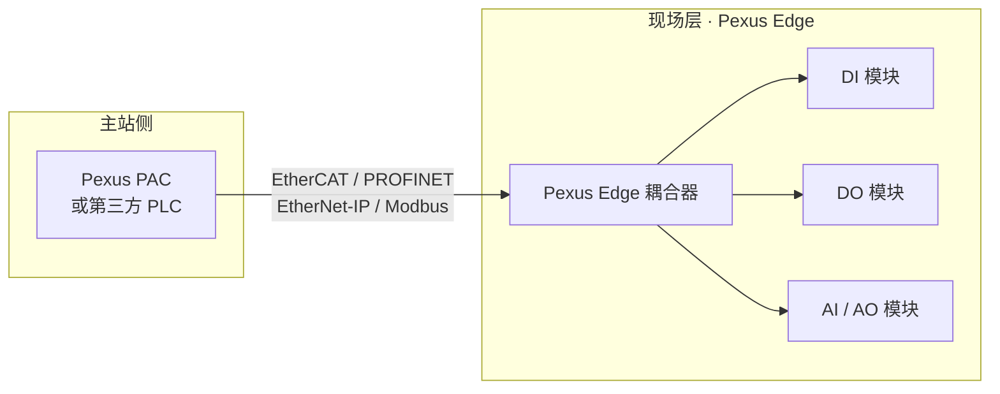

# Pexus Edge 分布式远程 I/O

**Pexus Edge** 是 Pexus 标准自动化控制平台的**分布式远程 I/O 产品系列**，包含**通讯耦合器**与**信号扩展模块**两大类。它将现场传感器、执行器信号就近采集与控制，通过工业总线与 Pexus PAC（或第三方 PLC）高速交换数据，帮助整线实现"信号就近接入、布线大幅简化、扩展按需伸缩"。

## 产品构成

### 耦合器（通讯模块）

耦合器是 Pexus Edge 网络的入口单元，负责总线通信与主站交互，并向下级联扩展模块：

| 总线 | 定位 | 文档入口 |
|------|------|---------|
| **EtherCAT** | 高性能实时工业以太网，微秒级确定性响应 | [查看](./edge/EtherCAT/) |
| **PROFINET** | 面向西门子生态，支持 TIA Portal 组态 | [查看](./edge/PROFINET/) |
| **EtherNet/IP** | 面向罗克韦尔生态，CIP 协议无缝对接 | [查看](./edge/EtherNetIP/) |
| **Modbus** | 经典协议，适配 HMI / SCADA / 各类 PLC | [查看](./edge/Modbus/) |

### 扩展模块（信号模块）

扩展模块挂在耦合器之后，按信号类型灵活组合：

| 模块 | 信号类型 | 文档入口 |
|------|---------|---------|
| **DI** | 数字量输入 | [查看](./edge/DI/) |
| **DO** | 数字量输出 | [查看](./edge/DO/) |
| **AI** | 模拟量输入 | [查看](./edge/AI/) |
| **AO** | 模拟量输出 | [查看](./edge/AO/) |

## 核心特性

- **一网多从站**：总线级联，从站节点按需扩展，适配分布式设备布局；
- **标准化组态**：支持主流 PLC 生态的工程软件（TIA Portal、倍福 TwinCAT、罗克韦尔 Studio 5000 等）快速识别与组态；
- **高可靠设计**：光电隔离、宽压输入、宽温工作，满足工业现场长时间稳定运行；
- **与 Pexus PAC 深度协同**：作为 Pexus 平台的现场层扩展，与 Pack Runtime 统一调度，也可作为标准从站接入任意第三方主站。

## 系统拓扑

## 文档导航

Pexus Edge 的完整技术文档（规格表、数据手册、总线介绍、命名规则、接线与安全参考）位于**远程 I/O 文档区**：

- [系统概述与规格表](./edge/)
- [EtherCAT 耦合器数据手册](./edge/EtherCAT/IM2610C-datasheet)
- [产品命名规则](./edge/Bus-intro/naming-reference)
- [接线参考指南](./edge/Bus-intro/wiring-reference)
- [安全参考说明](./edge/Bus-intro/safety-reference)

> 各总线耦合器与扩展模块的更多型号持续发布中，敬请关注。
