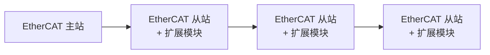
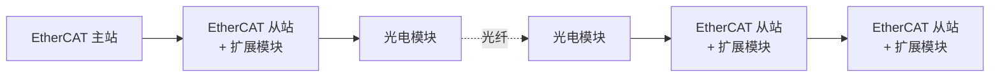
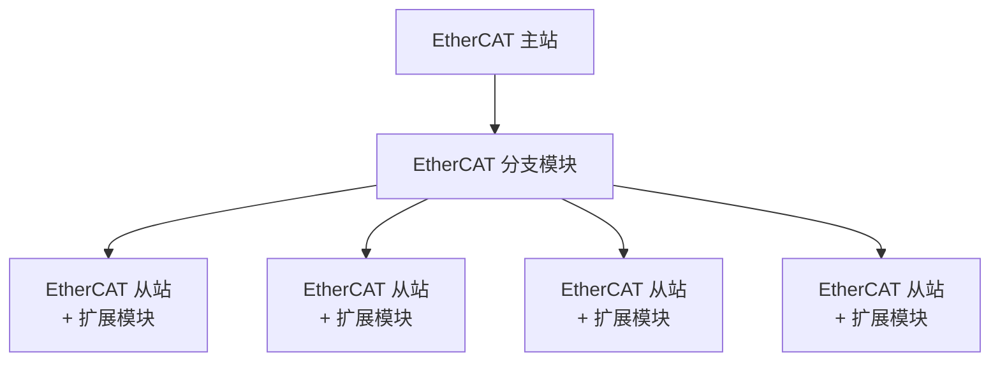
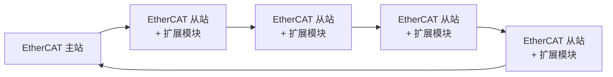

# EtherCAT 总线介绍

## 简介

EtherCAT 是一种基于以太网的现场总线系统，主要用于工业自动化领域的数据传输。其独特的通信方式突破了其他以太网解决方案的系统限制，使得数据传输更加高效。在 EtherCAT 网络中，数据通过一个环形或线性的网络结构传递，每个从站设备都会读取和写入数据，然后立即将数据包传递给下一个从站，网段内的最后一个从站设备将完全处理的数据帧作为响应帧发给主站。

EtherCAT 采用主从通信模式，即一个 EtherCAT 主站与多个 EtherCAT 从站进行通信。主站负责发送数据帧并接收从站的响应，而从站则负责接收主站的数据帧并执行相应的操作，然后将结果数据写入数据帧中返回给主站。这种传输方式能够在一个周期内实现数据通信，显著提高了带宽利用率。

EtherCAT 的技术特点包括**实时性**、**灵活性**和**高效性**。它支持多种设备连接拓扑结构，如环形和线性结构，从站节点使用专用的控制芯片，具有低延时和精准同步的特点，非常适合工业自动化应用。

EtherCAT 数据直接使用以太网数据帧传输，数据帧使用帧类型 `0x88A4`。EtherCAT 数据报文是由 2 个字节的数据头（EtherCAT 头）和 44 字节～1498 字节的 EtherCAT 数据组成。数据区由一个或多个 EtherCAT 子报文组成，每个子报文对应独立的设备或从站存储区域，主站使用不同的寻址方式通过 EtherCAT 子报文和从站设备完成数据交换。

## EtherCAT 通信类型

EtherCAT 通信类型主要包括**过程数据对象（PDO）**和**服务数据对象（SDO）**。PDO 用于周期性的数据交换，而 SDO 用于非周期性的数据交换。

### 过程数据通信（PDO 通信）

PDO 通信是 EtherCAT 总线网络中周期性进行主站与从站数据交互的功能。它主要用于周期性数据读取和控制，读写速度快，主站和从站通过 PDO 进行数据交换时，一方发送数据后，另一方不需要应答。PDO 列表可以看作一个数组空间，每个数组元素存放不同的功能码，这些功能码在一个周期中执行对应的操作。

### 服务数据通信（SDO 通信）

SDO 通信是一种请求应答式的数据交换方式，也称为邮箱通信，用于非周期性数据的配置和状态信息的读取。当需要进行非周期性数据交换时，主站会通过 SDO 发送一个请求，从站响应这个请求并返回数据。SDO 主要用于设备的配置和诊断等需要应答的数据交换。

## EtherCAT 通信

### 基于 EtherCAT（CoE）的 CAN 应用协议结构

在结构图中应用层对象字典里包含通信参数、应用程序数据，以及 PDO 的映射数据等。PDO 过程数据对象，包含了设备运行过程中的实时数据，且以周期性地进行读写访问。SDO 邮箱通信，则以非周期性地对一些通信参数对象、PDO 过程数据对象，进行访问修改。

- 继承了 CANopen 的对象字典概念，便于设备参数的统一管理。
- 支持 SDO（服务数据对象）和 PDO（过程数据对象）通信。
- 常用于传感器、执行器等设备的实时数据交换和配置。

### EtherCAT 设备描述文件（ESI 文件）

在 EtherCAT 中，ESI 设备描述文件是一个 XML 格式的文件，用于描述从站设备的配置和功能，它包含了从站设备的硬件和软件参数，以及和其它从站之间的通信规则。

该描述文件可以用于配置和识别 EtherCAT 网络中的从站设备，并确保网络中的所有设备能够正确地进行数据交换和协同工作。

### EtherCAT 通信状态转换

EtherCAT 设备必须支持 4 种状态，负责协调主站和从站应用程序在初始化和运行时的状态关系：

| 状态 | 简写 | 说明 |
|------|------|------|
| **Init** | I | 初始化 |
| **Pre-Operational** | P | 预运行 |
| **Safe-Operational** | S | 安全运行 |
| **Operational** | O | 运行 |

从初始化状态向运行状态转化时，必须按照 **初始化 → 预运行 → 安全运行 → 运行** 的顺序转化，不可以跳流程。从运行状态返回时可以跳流程转化。

| 状态和状态转化 | 操作 |
|--------------|------|
| 初始化（I） | 应用层无通信，主站只能读写 ESC 寄存器 |
| I→P | 主站配置从站站点地址；配置邮箱通道；配置 DC 分布式时钟；请求"预运行"状态 |
| 预运行（P） | 应用层邮箱数据通信（SDO） |
| P→S | 主站使用邮箱初始化过程数据映射；主站配置过程数据通信使用的 SM 通道；主站配置 FMMU；请求"安全状态" |
| 安全运行（S） | 有过程数据通信，但是只允许读输入数据，不产生输出信号（SDO、TxPDO） |
| S→O | 主站发送有效的输出数据以请求"运行状态" |
| 运行状态（O） | 输入和输出全部有效，仍然可以使用邮箱通信（SDO、TxPDO、RxPDO） |
| I→B | 进入引导状态 |
| 引导状态（B） | 可进行 FoE 通信，提供文件传输服务，实现固件升级 |
| B→I | 重启设备 |

### 过程数据对象（PDO）

#### 简介

过程数据对象（PDO）用于主站和从站之间的周期性数据交换。

- **输入过程数据对象（TxPDO）**：用于从站向主站反馈自身的状态。
- **输出过程数据对象（RxPDO）**：用于从站接收主站的指令。

#### PDO 映射

PDO 映射（PDO Mapping）用来映射需要通信的过程数据对象字典。映射类型分为接收 PDO 映射和发送 PDO 映射，两者的索引范围分别为 `0x1600`-`0x17FF` 和 `0x1A00`-`0x1BFF`。

用于进行 PDO 映射的对象字典，其值为需要进行 PDO 通信的过程数据对象字典索引、子索引和对象字典数据长度，基本组成如下：

| bit（位） | 31 … 16 | 15 … 8 | 7 … 0 |
|-----------|---------|--------|-------|
| 含义 | 索引 | 子索引 | 对象长度 |

索引和子索引共同决定对象在对象字典中的位置，对象长度指明该对象的具体位长，用十六进制表示：

| 位长 | 对象长度 |
|------|----------|
| 8 位 | `08h` |
| 16 位 | `10h` |
| 32 位 | `20h` |

#### PDO 分配

PDO 分配（PDO Assignment）用于配置 PDO 映射，PDO 分配分为接收 PDO 分配和发送 PDO 分配两个对象字典，两者的对象字典分别为 `0x1C12` 和 `0x1C13`。

### 服务数据对象（SDO）

在 EtherCAT 网络中，服务数据对象（SDO）是一个在 EtherCAT 从站和主站之间交换的数据结构，用于从机的配置、状态信息的通信和应用层数据的交换。SDO 可以用于在 EtherCAT 网络中传输从站的配置参数，如硬件配置、操作参数等。

### EtherCAT 主站和从站之间的通信

在 EtherCAT 网络中，主站和从站之间的时间同步是一个关键问题。EtherCAT 提供了三种同步模式：

- **自由运行模式（Free Run）**：此模式下，从站内的控制周期由本地定时器产生，因为 EtherCAT 网络中各个从站开始运行的时间不同，所以每个从站按照自己的运行周期刷新 IO，属于异步运行。

- **SM 同步模式（Sync Manager）**：指通过 SM 通道来实现数据同步的模式，主站下发的数据帧到达从站时，会触发同步管理器事件；当从站接收到该信号后，会立即进入中断服务程序中执行数据交换和 IO 刷新。此模式下，因为数据帧到达各个从站的时间不同，所以每个从站接收到数据存在时间差，从站越多、组态越复杂的系统同步效果越差。

- **DC 同步模式（Distributed Clock，分布式时钟）**：指分布式时钟同步模式，主站周期性读取支持 DC 同步功能从站的本地时钟（一般是网络中支持 DC 同步功能的第一个从站），然后将该时钟作为系统时钟周期性下发给其它从站，其它从站在接收到系统时钟后和自身时钟进行比较，根据时间偏差动态补偿调整自身时钟，从站通过 SYNC0 产生精确的同步信号并触发中断，从而控制各设备任务的同步执行。

### EtherCAT 从站寻址

EtherCAT 从站支持不同的寻址模式，在 EtherCAT 数据帧的帧头中有一个 32bit 的地址，用于实现物理节点寻址或逻辑寻址。

一个 EtherCAT 网段相当于一个以太网设备，EtherCAT 数据通过以太网帧进行传输，主站通过以太网帧首部的 MAC 目的地址寻址到 EtherCAT 网段，该过程即为**网段寻址**。

#### 设备寻址

在设备寻址时，EtherCAT 子报文内的 32 位地址分为 16 位从站设备地址和 16 位从站设备内部物理存储空间地址（从站内存偏移地址）。16 位从站设备地址可以寻址 65535 个从站设备，每个设备内最多可以有 64K 字节的内部存储空间。设备寻址时，每个子报文只寻址唯一的从站设备。

#### 逻辑寻址

逻辑寻址时，子报文内的 32 位地址是一个整体，表示逻辑地址，整个 EtherCAT 网段内的设备数据交换区地址通过 FMMU 映射到逻辑地址。数据通信时，主站不会区分具体设备地址，而是将整个 EtherCAT 网段当做一个数据存储空间进行访问，这种方式不需要复杂的内存映射，可以直接在网段内进行数据传输，极大地提高了数据传输速率，逻辑寻址方式特别适用于周期性交换数据。

#### 位置寻址（自动增量寻址）

从站的地址由其在网段内的连接位置确定，在网络启动阶段，主站发送带有负数地址的报文，报文经过从站时，其位置地址加 1，当地址为 0 时表明寻址到自己的报文，这种寻址方式也称为**自动增量寻址（Auto Increment Addressing）**。主站通过位置寻址的方式设置从站的站点地址（例如 1001、1002 等），然后从站可以使用与物理位置无关的站点地址来寻址从站。

#### 节点寻址（设置寻址）

节点寻址时，从站的地址和连接位置无关，主站通过站点地址或站点地址别名寻址到具体的设备，然后根据设备内的偏移地址（Offset Address）访问数据，节点寻址又称为**设置寻址**。

EtherCAT 通信接口模块支持站点地址别名功能，站点地址是在网络启动过程中，由主站通过位置寻址的方式自动设置给从站，站点地址别名在上位机上进行设置和启用，优先级高于站点地址，主站可以选择采用哪种地址进行节点寻址，默认使用站点地址方式。

> **注意**：部分通信接口模块只可通过上位机设置站点地址别名。

### 网络设备简介

| 网络设备/文件名称 | 描述 |
|------------------|------|
| EtherCAT 主站 | EtherCAT 网络中的管理者，网络中的数据都由主站主动发起。 |
| EtherCAT 从站 | EtherCAT 网络中的执行者，主要负责实时数据交换和控制逻辑的实现。 |
| 扩展模块 | 可挂载到通信接口模块或主站上的功能模块，执行主站下发的控制指令，刷新 IO。 |
| ESI 文件 | 即 EtherCAT 从站信息文件，是一个 XML 配置文件，包含了从站提供的功能和属性信息。主站需要通过这个文件对从站进行初始化设置。 |
| EDS 文件 | 即 EtherNet/IP 从站信息文件，是一个 XML 配置文件，包含了从站提供的功能和属性信息。主站需要通过这个文件对从站进行初始化设置。 |
| GSD 文件 | 即 PROFINET 从站信息文件，是一个 XML 配置文件，包含了从站提供的功能和属性信息。主站需要通过这个文件对从站进行初始化设置。 |
| 上位机配置软件 | 在电脑端运行的工业上位机软件，用于 EtherCAT 网络和主从站的配置，以及 PLC 软件编程、状态监控和故障排除。 |
| 通信线缆 | 用于 EtherCAT 数据帧传输，使用以太网超 5 类（100Base-TX）或更高的屏蔽双绞线，使用直线布线。 |
| EtherCAT 分支模块 | 用于在多轴复杂设备和产线组网中搭建星型拓扑组网（不支持环型拓扑）。 |
| 光电转换模块 | 用于以太网和光纤之间的转换，通过 EtherCAT 总线实现远距离通信，网线超过 100 米后可采用该模块增加通信距离。 |
| 光纤 | 用于在光纤模块之间进行远距离数据传输。 |

### 典型网络拓扑

本节提供典型的 EtherCAT 网络配置示例，包括线型、星型和环型拓扑结构，线型支持近距离直连通信和通过光纤模块远距离通信。

#### 线型（近距离通信）

#### 线型（远距离通信）

#### 星型

#### 环型

