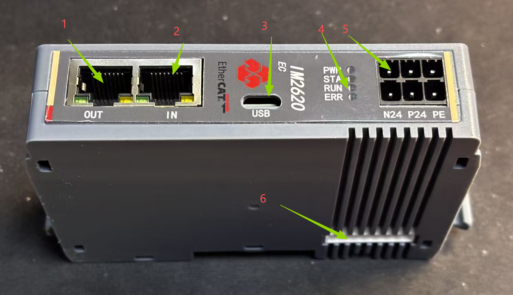
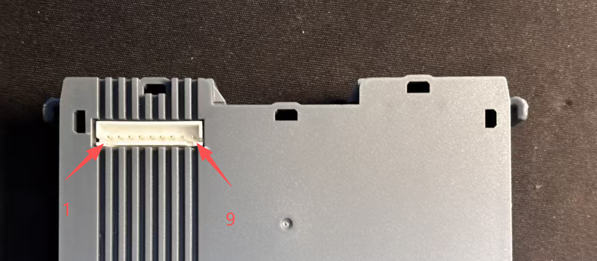
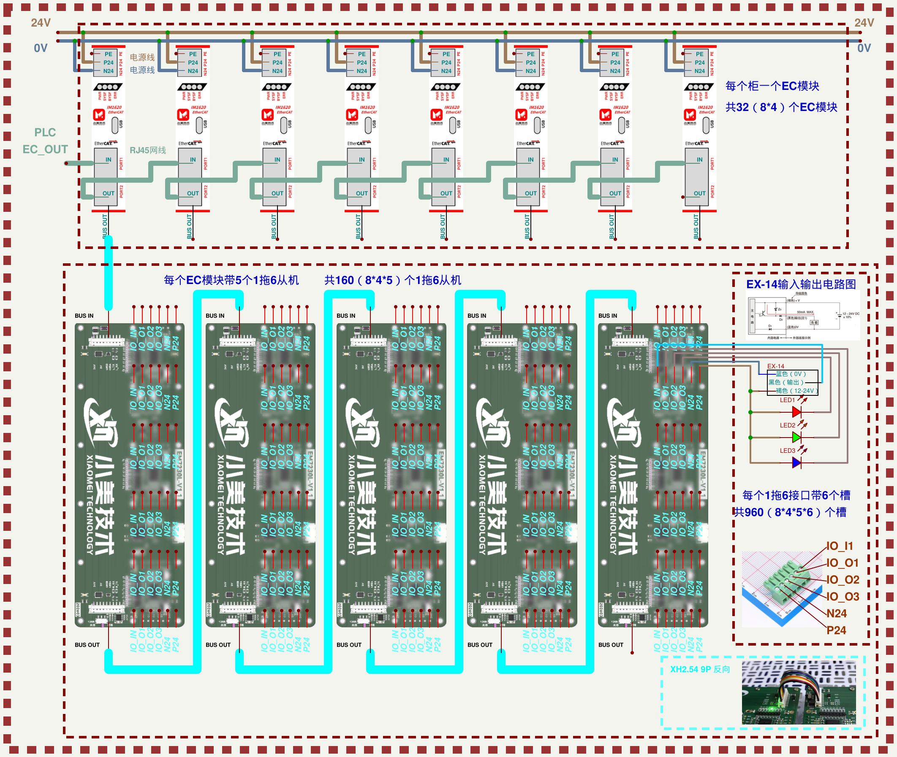
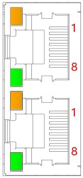

# IM2610C EtherCAT 远程耦合器（Pexus Edge）

## 产品概述

IM2610C 是 **Pexus Edge** 远程 I/O 系列中一款基于 EtherCAT 工业以太网总线协议的远程耦合器，作为 EtherCAT 网络中的从站设备，负责将主站的控制指令转发至后级扩展模块，同时将扩展模块的 IO 状态实时反馈至主站。

---

## 面板结构

| 编号 | 名称 | 说明 |
|------|------|------|
| 1 | RJ45_OUT | EtherCAT 总线输出端口 |
| 2 | RJ45_IN | EtherCAT 总线输入端口 |
| 3 | Upgrade | 程序升级 |
| 4 | 模块指示灯和指示灯标识 | 指示耦合器电源状态、运行状态 |
| 5 | 电源接线端子 | 6P 弹压式接线端子 |
| 6 | 总线通讯信号 | XH2.54 9P |

### 通讯信号引脚定义（XH2.54 9P）

| 引脚 | 信号 | 说明 |
|------|------|------|
| 1 | 24V | 现场电源正极 |
| 2 | 24V | 现场电源正极 |
| 3 | 0V | 现场电源负极 |
| 4 | 0V | 现场电源负极 |
| 5 | 485A | RS-485 差分信号 A |
| 6 | 485B | RS-485 差分信号 B |
| 7 | R_RX | 预留接收 |
| 8 | R_TX | 预留发送 |
| 9 | GND | 信号地 |

---

## 指示灯功能

### EtherCAT 耦合器指示灯

| 标识 | 名称 | 颜色 | 状态 | 状态描述 |
|------|------|------|------|---------|
| RUN | EtherCAT 运行状态指示灯 | 绿色 | 常亮 | EtherCAT OP 状态 |
| | | | 闪烁 2.5Hz | EtherCAT PreOP 状态 |
| | | | 单闪（常亮 200ms 熄灭 1s 循环变化） | EtherCAT SafeOP 状态 |
| | | | 闪烁 10Hz | BootStrap 状态 |
| | | | 熄灭 | EtherCAT Init 状态 |
| ERR | EtherCAT 故障指示灯 | 红色 | 双闪 $^{[1]}$ | EtherCAT 看门狗超时 |
| | | | 单闪（常亮 200ms 熄灭 1s 循环变化） | 模块本地错误 |
| | | | 闪烁 2.5Hz | 常规配置错误 |
| | | | 熄灭 | EtherCAT 通信正常 |
| IOR | IO 通讯指示灯 | 绿色 | 常亮 | I/O 过程数据已建立 |
| | | | 闪烁 1Hz | 无业务数据交互 |
| | | | 闪烁 10Hz | 耦合器固件升级 |
| IOE | IO 异常指示灯 | 红色 | 常亮 | 通讯异常 |
| | | | 熄灭 | 通讯无异常 |

> **[1] 双闪**：常亮 200ms 熄灭 200ms，再常亮 200ms 熄灭 1000ms，如此循环闪烁。

### 网络状态指示灯

| 标识 | 名称 | 颜色 | 状态 | 状态描述 |
|------|------|------|------|---------|
| IN | 网络状态指示灯 IN | 橙色 | 闪烁 | 连接建立并有数据交互 |
| | | | 熄灭 | 无数据交互或异常 |
| | | 绿色 | 常亮 | 建立网络连接 |
| | | | 熄灭 | 无网络连接建立或异常 |
| OUT | 网络状态指示灯 OUT | 橙色 | 闪烁 | 连接建立并有数据交互 |
| | | | 熄灭 | 无数据交互或异常 |
| | | 绿色 | 常亮 | 建立网络连接 |
| | | | 熄灭 | 无网络连接建立或异常 |

---

## 产品参数

### 接口参数

| 参数 | 规格 |
|------|------|
| 总线协议 | EtherCAT |
| 从站数量 | 根据主站支持的从站数量而定 |
| 数据传输介质 | Ethernet/EtherCAT CAT5 电缆 |
| 传输速率 | 100Mbps |
| 最小循环时间 $^{[1]}$ | 250μs |
| 传输距离 | ≤100m（站站距离） |
| 总线接口 | 2×RJ45 |
| *模块最大串接数量* | *5* | 
| 输入输出过程数据量 | 1024Bytes $^{[2]}$ |

> **[1]** PLC 与耦合器之间的循环时间（扫描周期）。
> **[2]** 上下行数据总长度不超过 1024Bytes。

### 电源参数

| 参数 | 规格 |
|------|------|
| 逻辑供电电压 | 24VDC（20V~28V） |
| 逻辑供电电流 | Max：100mA（24VDC） |
| 现场供电电压 | 24VDC（20V~28V） |
| 现场供电电流 | Max：2A（24VDC，含 2A 保险丝） |
| 背板供电电压 | 24V DC |

### 物理特性

| 参数 | 规格 |
|------|------|
| 外形尺寸（宽×高×深） | 130 × 73 × 27 mm |
| 重量 | 78g |
| 防护等级 | IP20 |
| 安装方式 | DIN 35mm 导轨 |

### 环境适应性

| 参数 | 规格 |
|------|------|
| 工作温度 | -20℃ ~ +60℃ |
| 存储温度 | -40℃ ~ +80℃ |
| 相对湿度 | 95%，无冷凝 |
| 海拔高度 | ≤2000m |
| 过电压类别 | I |
| 污染等级 | 2 级 |

### 抗震动与抗冲击

| 项目 | 标准 | 参数 |
|------|------|------|
| 耐振动 | IEC 60068-2-6 正弦振动 | 5Hz~8.4Hz，3.5mm；8.4Hz~150Hz，1g；X/Y/Z 三轴向，10 个循环/轴向（100min） |
| 耐冲击 | IEC 60068-2-27 机械冲击 | 150m/s²，11ms，±X/Y/Z 六个方向，3 次/方向，共 18 次 |

### 电磁兼容性（EMC）

| 项目 | 等级 | 参数 |
|------|------|------|
| 静电放电 | Level 3 | 接触 ±8KV，空气 ±8KV，IEC61000-4-2 |
| 浪涌 | Level 3 | 1KV DM，2KV CM，IEC61000-4-5 |
| 电快速脉冲群 | Level 4 | 电源线 ±4KV，IEC61000-4-4 |

### 功能特性

| 功能 | 支持情况 |
|------|---------|
| 模块异常自恢复 | 支持 |
| 通过 SDO 访问 PDO | 支持 |
| 诊断 | 支持 |
| 告警 | 支持 |
| 固件升级 | 支持 |
| 短路保护 | 支持（自动恢复机制） |
| 反接保护 | 支持（自动恢复机制） |
| 浪涌保护 | 支持 |

### 认证

| 认证 | 标准 |
|------|------|
| CE-EMC | EN IEC 61000-6-4 / EN IEC 61000-6-2 |

---

## 电源接线

使用 24VDC 电源模块，参照接线方法，根据下图所示电路，将电源接好，同时可靠接地（电源线推荐选用双绞线）。

::: caution 断电操作
接线前必须切断所有外部供电电源。
:::

*图 3：IM2610C 电源接线示意*

---

## 总线接线

采用标准 RJ45 网络接口与标准水晶接头，引脚分配如下表所示。

*图 4：RJ45 引脚定义示意*

| 引脚号 | 信号 | 引脚号 | 信号 |
|--------|------|--------|------|
| 1 | TD+ | 5 | — |
| 2 | TD- | 6 | RD- |
| 3 | RD+ | 7 | — |
| 4 | — | 8 | — |

::: notice 注意事项
- 推荐使用类别 5 或更高等级的双屏蔽（编织网+铝箔）STP 电缆作为通讯电缆。
- 设备之间线缆的长度不能超过 100m。
:::

<!-- ---

## 外形尺寸图

<!-- TODO: 插入外形尺寸图 -->

*图 5：IM2610C 外形尺寸图（单位：mm）* -->

---

## 订购信息

| 产品型号 | 描述 |
|---------|------|
| IM2610C | EtherCAT 远程耦合器 |

---

## 版本历史

| 版本 | 日期 | 变更说明 |
|------|------|---------|
| V1.0 | 2026-08 | 初始版本 |

