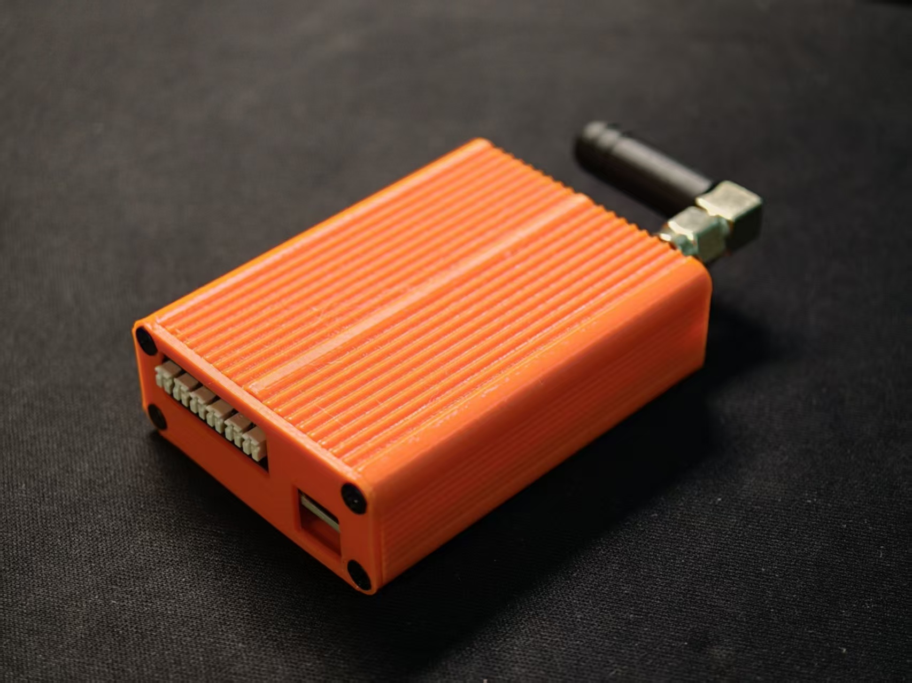
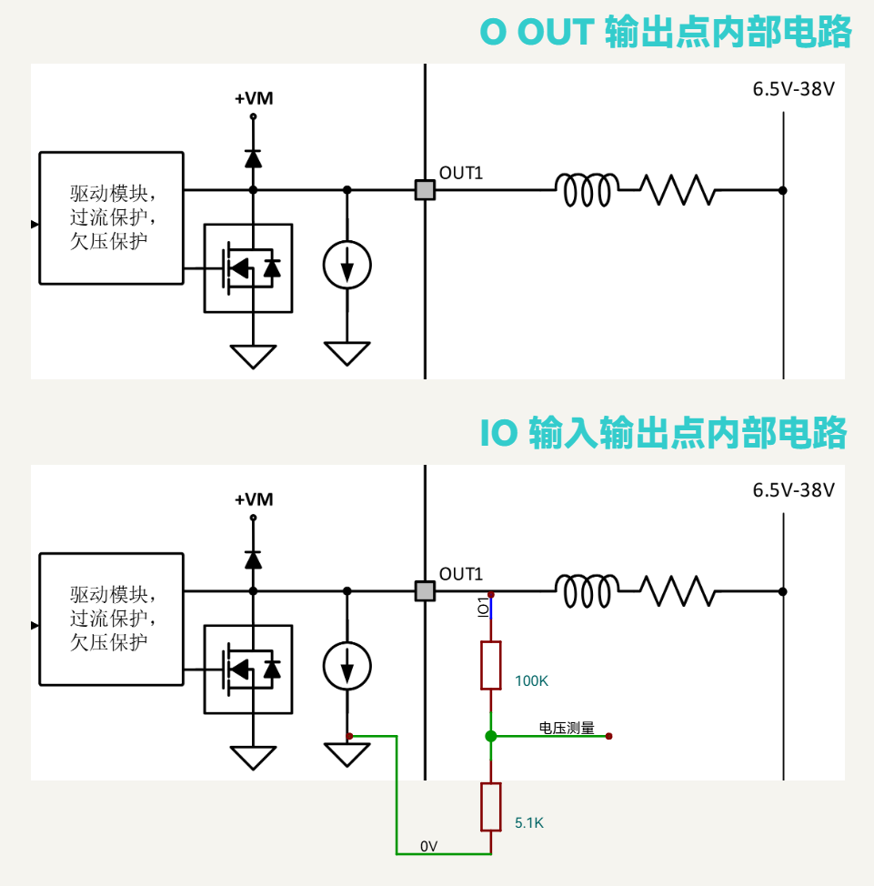
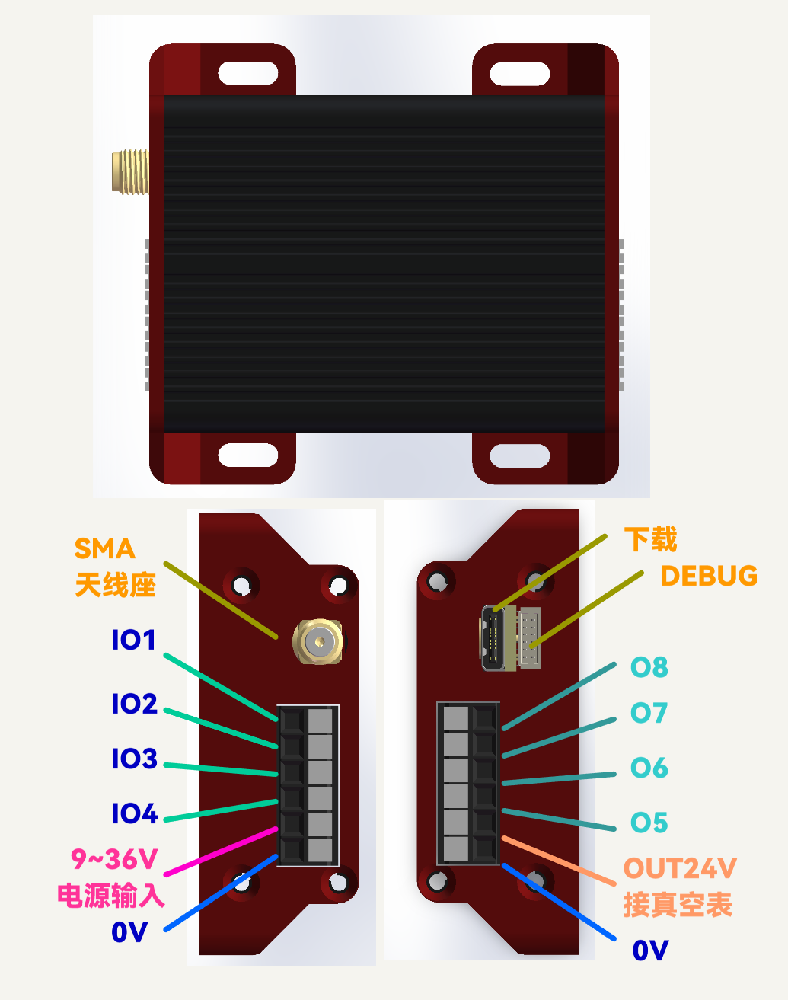

# WM9832 无线数字量输入输出模块（Pexus Edge）

## 产品概述

WM9832 是 **Pexus Edge** 无线远程 I/O 系列中的一款 2.4G 私有协议无线数字量模块，提供 **4 路可配置数字输入/输出（IO1~IO4）+ 4 路数字输出（O5~O8）**，共 8 路信号通道。本模块需与 **WM8232 无线接收机**配套使用。模块支持 DC 9~36V 工业宽压供电，内置断电后备续航电路；后备输出常态持续输出 DC 24V / 最大 200mA，外部主电断电后仍继续输出，后备输出及无线通信可维持 ≥3s，可适配碳刷设备短时供电不稳、瞬时掉电等工业工况。

模块通讯核心采用高集成度、低功耗 2.4GHz 无线射频芯片（CH592），物理层复用 Bluetooth Low Energy（BLE 5.4）标准调制解调规范，链路层采用基于底层 RF_PHY 接口的深度定制 2.4G 私有协议，实现**高频宽、低延迟、封闭安全**的数据传输，**上报回报率 10Hz**。

---

## 面板结构与引脚定义

### 模块整体规格

本模块为 4 路可配置数字输入输出（IO1~IO4）+ 4 路数字输出（O5~O8）无线 IO 模块，支持 DC 9~36V 宽压供电，内置断电后备续航电路；后备输出常态持续输出 DC 24V / 最大 200mA，外部主电断电后仍继续输出，后备输出及无线通信可维持 ≥3s。

*图 1：WM9832 实物图（含天线）*

*图 2：WM9832 内部引脚原理图*

*图 3：WM9832 外部引脚对照图*

### 引脚功能对照表

| 引脚序号 | 引脚标识 | 功能定义 | 功能说明 |
|------|------|------|------|
| 1 | IO1 | 可配置输入输出 1 | 软件切换数字输入 / 数字输出，支持电平采集与负载驱动 |
| 2 | IO2 | 可配置输入输出 2 | 软件切换数字输入 / 数字输出，支持电平采集与负载驱动 |
| 3 | IO3 | 可配置输入输出 3 | 软件切换数字输入 / 数字输出，支持电平采集与负载驱动 |
| 4 | IO4 | 可配置输入输出 4 | 软件切换数字输入 / 数字输出，支持电平采集与负载驱动 |
| 5 | 9~36V | 电源正极 | 模块主供电输入，额定电压 DC 9~36V |
| 6 | 0V | 电源地 | 模块公共电源地，所有信号、负载必须共地 |
| 7 | O5 | 数字输出 5 | 纯输出通道，驱动开关量负载 |
| 8 | O6 | 数字输出 6 | 纯输出通道，驱动开关量负载 |
| 9 | O7 | 数字输出 7 | 纯输出通道，驱动开关量负载 |
| 10 | O8 | 数字输出 8 | 纯输出通道，驱动开关量负载 |
| 11 | OUT 后备 | 后备输出 | 常态持续输出 DC 24V / 最大 200mA；主电断电后继续输出，配合无线通信维持 ≥3s 工作时长 |
| 12 | 0V | 信号地 | IO、后备输出回路专用公共地 |

### 引脚功能综述

- **可配置 IO 通道（IO1~IO4）**：双向多功能通道，软件自由切换数字输入、数字输出模式，兼顾信号采集与负载控制需求。
- **数字输出通道（O5~O8）**：纯输出通道，用于驱动开关量负载，内置续流保护与负载开路诊断。
- **供电与后备电路**：DC 9~36V 工业宽压供电；后备输出常态持续输出 DC 24V / 最大 200mA，内置储能后备电路，针对碳刷设备瞬时掉电、供电波动工况，主电断开后仍继续输出，保障后备输出供电、无线通信持续工作 ≥3 秒。

### 引脚使用通用规范

::: caution 注意事项
- 所有信号引脚、后备输出引脚必须与模块 0V 可靠共地，否则会出现电平采样异常、输出驱动失效、后备功能异常等问题。
- 模块仅支持 DC 9~36V 电压输入，禁止超压、反压接入，避免损坏设备。
- 后备输出为常态持续输出；断电后继续输出为短时续航功能，仅用于工况容错适配，不支持长期带载工作。
:::

::: warning 警告
后备输出（OUT 后备）为独立输出端口，禁止与模块主供电（9~36V）、其他信号 / 输出端口并联或回接，否则可能损坏模块或导致后备功能失效。
:::

---

## 端口功能详解

本模块搭载 4 路可配置输入输出 IO（IO1~IO4）+ 4 路数字输出 O（O5~O8），共 8 路信号通道。所有输出通道均内置**硬件级负载开路诊断功能**，用于实时检测负载断线、脱落等异常状态。

### IO1~IO4 可配置端口

#### 数字输入模式

端口切换为输入模式时，关闭输出驱动，仅用于外部电平采集。

- 通过端口电平检测外部设备拉低、悬空、拉高三种状态；
- 输入触发阈值软件可调，适配不同传感器、开关信号；
- 支持宽电压输入采集范围 9~36V。

> **微弱静态电流说明**：端口在工作状态下存在固定的微弱静态诊断电流（典型值 30µA），属于产品正常检测机制，用于提升故障识别精度。外接高阻信号时需注意信号驱动能力，避免微弱电平偏移导致采样误判。

#### 数字输出模式

端口切换为输出模式时，可对外驱动开关量负载，内置续流保护电路，适配电磁阀、继电器等感性负载，**单路最大持续驱动电流 400mA**。

输出关闭状态下，端口依然保留固定微弱诊断电流，用于持续监测负载是否断线。

### O5~O8 数字输出端口

O5~O8 为专用数字输出端口，用于驱动开关量负载。

- 单路最大持续驱动电流 400mA；
- 内置续流保护电路，适配电磁阀、继电器等感性负载；
- 内置负载开路诊断，输出关闭时保留 30µA 诊断电流。

::: caution 负载使用限制
禁止直接驱动电机类负载，电机冲击电流与反向电动势易损坏端口，需外接继电器、接触器等扩容开关器件转接。
:::

### 输出端口 LED 微亮现象说明

本产品所有输出通道（IO1~IO4 配置为输出时及 O5~O8）出厂默认开启负载开路智能诊断功能。输出关闭状态时，端口会持续输出 **30µA 恒定微弱电流**，用于全天候检测负载断线、脱落故障。该电流属于正常产品功能，并非漏电或故障：

- 普通负载无任何影响；
- 高效率 LED 负载因灵敏度极高，微小电流即可引发关灯后微弱微光现象。

**工程标准解决方案**：在 LED 负载两端并联泄放电阻，让微弱诊断电流从电阻旁路释放，彻底消除微光。

- 推荐阻值：4.7kΩ ~ 10kΩ；
- 效果：旁路后 LED 两端电压极低，完全低于导通阈值，关灯彻底无余光。

### 端口特性对比表

| 功能项 | IO1~IO4（可配置输入输出） | O5~O8（数字输出） |
|------|------|------|
| 数字输出控制 | 支持 | 支持 |
| 数字输入采集 | 支持，阈值软件可调 | 不支持 |
| 断线诊断电流 | 典型 30µA（输出模式常态开启） | 典型 30µA |
| 悬空 / 拉低状态检测 | 支持 | 不支持 |
| 适用场景 | 信号采集 + 负载控制双向场景 | 纯负载控制场景 |

### 重要使用须知

- 诊断电流为产品正常故障检测功能，不可关闭，用于保障现场断线可被系统及时识别。
- IO 输入模式严禁长期接入高阻微弱信号，避免采样不稳定。
- LED 负载必须外接并联电阻消除微光，属于标准工程接法。
- 白炽灯等冷态电阻小、启动冲击电流大的负载不宜直接驱动：冷态电阻小、发热后增大的特性会导致上电瞬间过流触发保护，无法点亮。

---

## 无线通讯方案

### 通讯核心

模块通讯核心采用高集成度、低功耗 2.4GHz 无线射频芯片 **CH592**。系统在物理层（PHY）严格遵循并复用 **Bluetooth Low Energy（BLE 5.4）** 标准调制解调规范，链路层摒弃通用标准，采用基于底层 **RF_PHY** 接口的深度定制 **2.4G 私有协议**，实现高频宽、低延迟、封闭安全的数据传输。

> 本模块需与 **WM8232 无线接收机**配套使用，由接收机接收并还原模块上报的 I/O 状态。

### 无线射频参数

| 参数 | 规格 |
|------|------|
| 工作频段 | 2.4GHz ISM（2400 ~ 2483.5 MHz） |
| 信道划分 | 40 个射频信道，2MHz 信道间隔（3 个发现信道 + 37 个数据信道） |
| 传输速率 | 1Mbps / 2Mbps |
| 发射功率 | -20dBm ~ +4.5dBm（约 2.8mW，支持动态功率调整） |
| 接收灵敏度 | -95dBm |
| 上报回报率 | 10Hz |
| 协议栈 | 私有 2.4G 协议（RF_PHY），非标准 BLE 广播 / 连接协议 |
| 数据加密 | 硬件级 AES 加密引擎 |

### 网络共存与抗干扰

针对企业内部高密度部署的 Wi-Fi（2.4GHz / 5GHz）及其他办公无线设备，本系统具备良好的网络共存性：

- **动态信道避障机制**：实时监测 40 个信道状态，检测到干扰或高流量时动态切换至最佳空闲信道，主动避让企业核心网络。
- **极低空中占空时间（Air-Time）**：得益于 2Mbps 高速率，以微秒级时间完成收发后立即进入休眠，极大降低对公共 2.4G 频段的时间占用。
- **受限发射功率**：最高发射功率 +4.5dBm，覆盖范围严格控制在单台设备操作物理区域内，信号衰减快，不穿透墙壁或楼层干扰相邻区域。

### 数据安全与加密

- **私有协议壁垒**：不使用公开 BLE 广播与连接协议栈，直接调用 RF_PHY 开发闭源私有协议，市面标准蓝牙抓包工具、嗅探器或智能手机均无法解析甚至无法识别数据包格式。
- **硬件级 AES 加密**：业务数据载荷通过芯片级硬件加密引擎进行 AES 高强度加密，即便近距离捕获 2.4G 电磁波信号，也无法还原与解密真实载荷内容。

### 电磁暴露与健康

- **远低于豁免标准的发射功率**：最高 +4.5dBm（约 2.8mW），低于 ICNIRP 及 FCC/CE 对 2.4GHz 便携设备 20mW 的 SAR 豁免阈值，峰值辐射量仅为普通智能手机（约 200mW）的百分之一。
- **极低占空比工作机制**：仅在极短瞬间唤醒射频收发器，天线绝大部分时间处于断电或静默状态，时均电磁暴露量趋近于零。

### 合规性认证

| 认证 | 标准 / 编号 |
|------|------|
| BQB（Bluetooth SIG） | Listing Details 142898（底层射频收发器、基带及链路控制技术） |

> 底层射频技术已完整通过蓝牙技术联盟官方 BQB 认证，证明其物理层电磁行为、频率容差、发射频谱辐射等指标符合国际 2.4G 射频合规标准。

---

## 产品参数

### 电气特性

| 参数 | 典型值 | 说明 |
|------|------|------|
| 负载诊断静态电流 | 30µA | 所有输出通道常态有效，用于断线检测 |
| IO 输入电压范围 | 9~36V | 仅 IO1~IO4 输入模式 |
| 输出负载电压范围 | 9~36V | 全部 8 路通道 |
| 单路输出最大驱动电流 | 400mA | 单路通道持续负载电流上限，禁止超流使用 |
| 内置续流保护 | 支持 | 适配感性负载，吸收反向电动势，保护端口电路 |

### 电源参数

| 参数 | 规格 |
|------|------|
| 主供电电压 | DC 9~36V |
| 后备输出 | DC 24V / 最大 200mA（常态持续输出，外部主电断电后仍继续输出） |
| 断电后备续航 | ≥3s（外部主电断电后，后备输出及无线通信维持） |

### 功能特性

| 功能 | 支持情况 |
|------|---------|
| 负载开路智能诊断 | 支持（30µA 诊断电流，常态开启） |
| 断线 / 脱落检测 | 支持 |
| 输入阈值软件可调 | 支持 |
| 后备输出 | DC 24V / 最大 200mA（常态持续输出） |
| 断电后备续航 | 支持（≥3s） |
| 2.4G 私有协议 | 支持（BLE 5.4 PHY + RF_PHY 私有协议） |
| 硬件级 AES 加密 | 支持 |
| 上报回报率 | 10Hz |

### 物理特性与环境适应性

::: warning 规格说明
以下参数以正式发布的产品数据手册为准。
:::

| 项目 | 规格 |
|------|------|
| 外形尺寸（宽×高×深） | 60 × 21.8 × 80 mm（含天线） |
| 重量 | 以实际产品为准 |
| 防护等级 | 以实际产品为准 |
| 安装方式 | 以实际产品为准 |
| 工作温度 | 以实际产品为准 |
| 存储温度 | 以实际产品为准 |

*图 4：WM9832 外形尺寸图（单位：mm）*

---

## 接线与使用

### 电源接线

使用 DC 9~36V 电源模块，参照引脚定义将电源接好，同时可靠接地。

::: caution 断电操作
接线前必须切断所有外部供电电源。
:::

::: notice 接线要求
- 所有信号引脚、后备输出引脚必须与模块 0V 可靠共地；
- 禁止超压、反压接入；
- 输出通道禁止直接驱动电机类负载，电机负载必须外接继电器、接触器驱动。
:::

---

## 订购信息

| 产品型号 | 描述 |
|---------|------|
| WM9832 | 无线数字量输入输出模块（4IO + 4DO，2.4G 私有协议，10Hz 回报率） |

---

## 版本历史

| 版本 | 日期 | 变更说明 |
|------|------|---------|
| V1.0 | 2026-08 | 初始版本 |