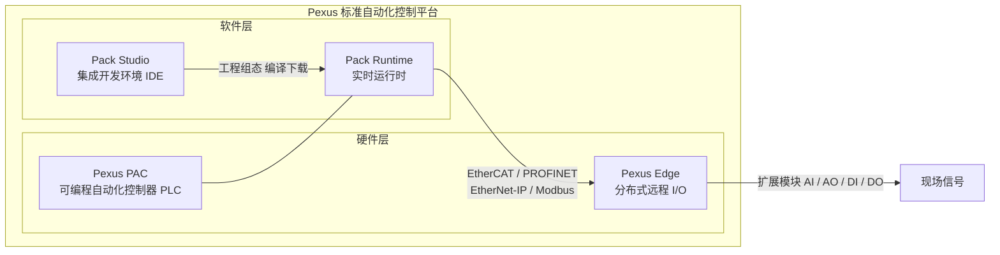

# Pexus 标准自动化控制平台

::: tip 系列定位
**Pexus** 是小美技术面向包装自动化与整线控制推出的**标准自动化控制平台**品牌。它以"稳定可靠、开箱即用、可持续演进"为设计目标，将控制器、远程 I/O 与配套软件工具链整合为一套可复用的工程底座，帮助设备商与集成商快速构建可交付、可维护、可复制的自动化系统。
:::

## 品牌释义

**Pexus** 取自 **Pack Automation Control Kernel Nexus**，意为"Pack 自动化控制内核的中枢"。

- **Pack Automation** —— 面向整线/整机（Pack/Process）级自动化场景；
- **Control Kernel** —— 以实时控制内核为核心；
- **Nexus** —— 设备、总线和上位系统在此汇聚连接。

在品牌层面，Pexus 代表小美技术**标准化、平台化**的自动化产品体系；而"小美技术"仍作为公司品牌与专业技术服务品牌存在。二者关系：**Pexus 是产品，小美技术是背后的工程与服务能力**。

## 产品体系总览

Pexus 由**硬件**与**软件工具链**两大支柱组成：

| 层级 | 产品 | 全称 / 定位 | 文档入口 |
|------|------|------------|---------|
| 硬件 | **Pexus PAC** | Programmable Automation Controller · 可编程自动化控制器（PLC），整线/整机主控 | [查看](./pac) |
| 硬件 | **Pexus Edge** | Edge Remote I/O · 分布式远程 I/O 系列（耦合器 + 扩展模块） | [查看](./edge) |
| 软件 | **Pack Studio** | 集成开发环境（IDE）：工程组态、编程、调试与诊断 | [查看](./studio) |
| 软件 | **Pack Runtime** | 运行时：现场实时执行内核，承载控制程序与总线调度 | [查看](./runtime) |

## 设计理念

- **一套工具，全系通用**：PAC 与 Edge 由同一套软件生态（Pack Studio + Pack Runtime）支撑，统一工程、统一变量、统一调试体验，降低学习与维护成本。
- **标准优先，按需定制**：标准产品以系列化、可量产方式交付；特殊工艺场景可基于小美技术定制能力（飞达控制器、专用 I/O 等）做增量开发，再回归标准体系。
- **开放总线，即插即用**：支持 EtherCAT、PROFINET、EtherNet/IP、Modbus 等主流现场总线，与既有生态无缝对接。
- **工程化交付**：延续小美技术"工程化交付 + 标准化组件"理念，从 PoC 验证到规模化落地保持一致性与可维护性。

## 产品家族与命名

Pexus 标准系列之外，小美技术还提供面向特定工艺的**定制系列**产品（如飞达控制器、模块可分离式远程 I/O、直驱伺服滚筒驱动器等），两者共同构成完整的自动化产品版图：

- **标准系列（Pexus）**：批量交付、平台化演进，作为系统选型的默认起点；
- **定制系列（Custom）**：针对专用工艺深度定制，是标准产品的有效补充。

## 快速开始

1. 了解控制器平台 → [Pexus PAC](./pac)
2. 了解远程 I/O 与总线 → [Pexus Edge](./edge)
3. 了解组态编程工具 → [Pack Studio](./studio)
4. 了解现场运行内核 → [Pack Runtime](./runtime)

> 更多技术规格、数据手册与应用指南正在持续完善中，敬请期待。
