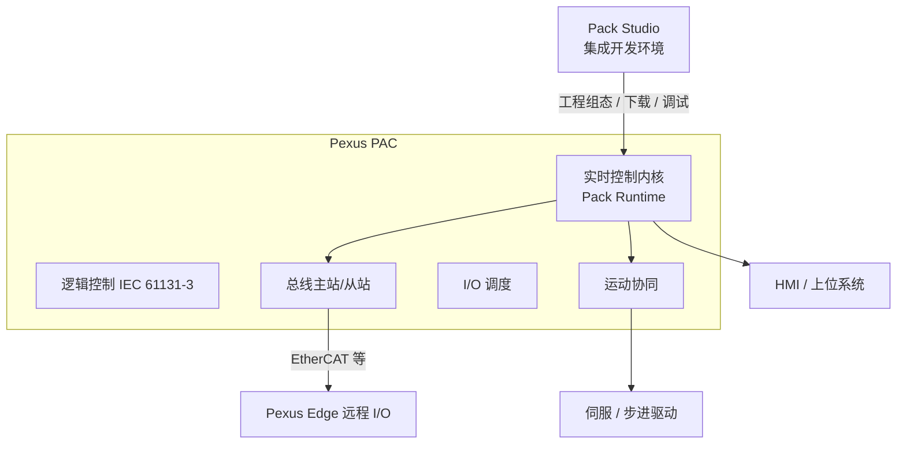

# Pexus PAC 可编程自动化控制器

**Pexus PAC**（Programmable Automation Controller）是 Pexus 标准自动化控制平台的**主控核心**，定位为面向整机与整线场景的可编程自动化控制器（PLC）。它把逻辑控制、运动协同、现场总线调度与数据上送集成于一体，是 Pack Studio 工程与 Pack Runtime 运行的硬件载体。

## 产品定位

- **整机主控**：作为贴装、包装、分拣、输送等设备/产线的控制中枢，统一调度逻辑、轴运动与 I/O 信号；
- **标准平台**：与 Pexus Edge 远程 I/O、Pack Studio / Pack Runtime 构成闭环，随平台版本持续演进；
- **面向集成**：开放的现场总线接口（EtherCAT、PROFINET、EtherNet/IP、Modbus 等），便于接入既有上位系统（MES/SCADA）与第三方设备。

## 系统架构

| 组成 | 说明 |
|------|------|
| **实时内核** | 集成 Pack Runtime，保障确定性扫描与任务调度 |
| **逻辑控制** | 面向顺序控制、过程控制的标准化编程模型 |
| **运动协同** | 支持轴控与整线节拍协调，适配高速供料与精密定位场景 |
| **I/O 调度** | 通过 Pexus Edge 扩展现场信号采集与控制通道 |
| **总线能力** | 适配主流工业以太网与现场总线，向上对接 HMI/SCADA/MES |

## 核心特性

- **确定性实时控制**：内置实时内核，任务周期稳定可控，满足整线节拍要求；
- **软件定义功能**：控制逻辑通过 Pack Studio 组态与编程，支持在线调试与版本化管理；
- **弹性 I/O 扩展**：依托 Pexus Edge 系列按需扩展 AI / AO / DI / DO，小规模到大规模灵活伸缩；
- **开放式集成**：支持主流总线协议与上位接口，保护既有投资；
- **工业级可靠性**：面向工业现场电磁环境与宽温工况设计，满足 7×24 小时运行要求。

## 典型应用

- 包装与贴装设备的整机控制
- 供料、分拣、输送线的整线协同
- 需要"逻辑 + 运动 + 分布式 I/O"一体的中小型自动化系统

## 技术规格

::: warning 规格说明
以下为 Pexus PAC 规格框架，具体参数以正式发布的产品数据手册为准。
:::

| 项目 | 规格 |
|------|------|
| 产品名称 | Pexus PAC |
| 产品类型 | 可编程自动化控制器（Programmable Automation Controller） |
| 编程软件 | Pack Studio |
| 运行内核 | Pack Runtime |
| 支持的远程 I/O | Pexus Edge 系列（Pexus Edge 耦合器 + 扩展模块） |
| 支持的现场总线 | EtherCAT / PROFINET / EtherNet/IP / Modbus（以发布版本为准） |
| 工作电源 | DC 24V（以发布为准） |
| 工作温度 | 以发布为准 |
| 防护等级 | 以发布为准 |

> 首批 Pexus PAC 产品资料与数据手册正在筹备中，欢迎联系小美技术销售与工程团队获取最新进展。
