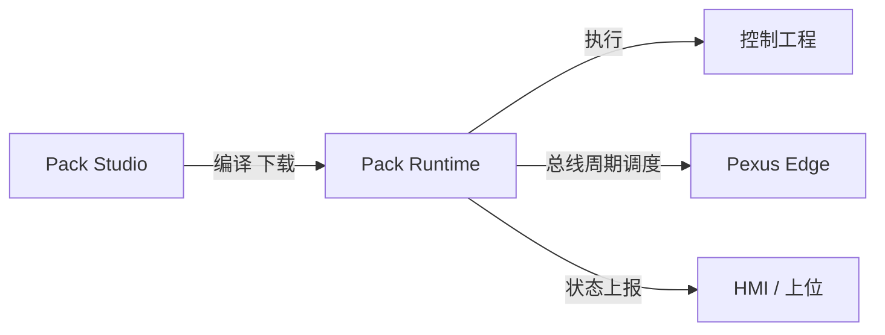

# Pack Runtime 运行时

**Pack Runtime** 是 Pexus 标准自动化控制平台的**实时运行内核**，承载由 Pack Studio 编译下发的控制工程，在 Pexus PAC 上执行逻辑调度、总线通信与 I/O 刷新，是连接"开发环境"与"现场设备"的执行底座。

## 定位

- **确定性执行**：以实时内核调度控制任务，保证周期性与节拍稳定；
- **标准运行平台**：为 Pexus 全系（PAC + Edge）提供统一运行语义；
- **现场守护**：负责设备状态管理、报警处理与安全停机等运行保障。

## 职责范围

| 职责 | 说明 |
|------|------|
| **任务调度** | 按工程定义周期执行控制程序（逻辑、运动、通信任务） |
| **总线管理** | 维护与 Pexus Edge 及第三方从站的实时数据交换 |
| **I/O 刷新** | 周期性读写现场信号，保持过程数据一致性 |
| **状态与报警** | 监测运行状态、输出报警与诊断信息 |
| **在线协同** | 配合 Pack Studio 在线监控、强制与调试 |
| **固件化交付** | 与 PAC 硬件深度绑定，随产品版本统一维护 |

## 运行关系

## 核心特性

- **高实时性**：面向微秒级节拍与确定性控制设计；
- **强健壮性**：任务超时、通信异常、掉站等场景具备保护与恢复机制；
- **版本可管理**：与 Pack Studio 工程版本对应，支持运行版本追溯与升级；
- **生态一致**：对 Pexus Edge 开箱即用，减少现场联调成本。

::: warning 说明
Pack Runtime 的详细技术规格（任务周期、容量、兼容性等）将随正式版本发布，敬请期待。
:::

> Pack Runtime 作为 Pexus 平台的软件支柱之一，与 Pexus PAC、Pexus Edge、Pack Studio 共同构成完整的标准自动化控制体系。相关进展请关注官网更新。
