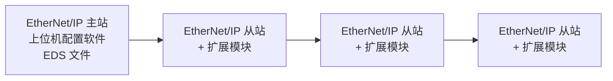
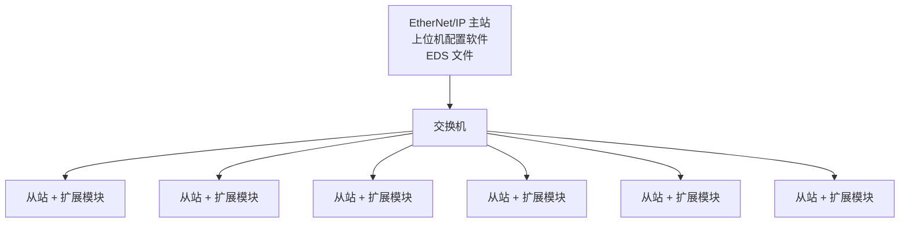

# EtherNet/IP 总线介绍

## 简介

EtherNet/IP（EtherNet Industrial Protocol，以太网工业协议）是一种基于标准以太网技术的工业通信协议，专为工业自动化和控制系统设计，由 ODVA（Open DeviceNet Vendors Association，开放 DeviceNet 厂商协会）开发维护。EtherNet/IP 凭借其开放性和兼容性，成为工业自动化领域的主流协议之一。

### EtherNet/IP 通信特点

EtherNet/IP 具有以下特点：

- **标准化**：EtherNet/IP 建立在标准的 TCP/UDP 协议之上，完全符合标准的 IEEE 802.3U 标准，支持星型、树型、环型、线型等拓扑结构，所有标准以太网节点的设备均可加入此网络。

- **实时性**：EtherNet/IP 数据传输分为隐式报文通信和显式报文通信，两种通信模式分别对应实时控制和数据交换的场景，适用于制造业、过程控制等领域。

- **通信效率高**：EtherNet/IP 采用生产者/消费者技术，允许网络上的节点同时存取同一个源的数据。在生产/消费模式中，对每个数据均分配一个唯一的标识，每个数据源将数据一次性的发送到网络上，其他节点选择性的读取这些数据，从而极大地提高系统的通信效率。

- **EtherNet/IP 设备应用广泛**：EtherNet/IP 通信设备支持多种设备类型（例如 PLC、传感器和驱动器等），包括简单的 IO 设备、传感器（例如扫码枪和相机等）、执行器以及复杂的控制设备（例如机器人、PLC 和焊机等）。

### EtherNet/IP 通信模式

EtherNet/IP 的通信基于两种模式：**显式消息（Explicit Messaging）**和**隐式消息（Implicit Messaging）**。

#### 显式消息（Explicit Messaging）

- **用途**：非实时通信，用于设备配置、参数读写、诊断等。
- **协议**：基于 TCP/IP，采用客户端-服务器模型。
- **特点**：
  - 通过请求-响应机制实现，类似于 HTTP。
  - 使用 CIP 对象模型描述设备功能（例如 Identity 对象、Assembly 对象）。

#### 隐式消息（Implicit Messaging）

- **用途**：实时通信，用于高速数据传输（例如 IO 控制、运动控制）。
- **协议**：基于 UDP/IP，采用生产者-消费者模型。
- **特点**：
  - 数据以周期性或事件驱动方式传输，低延迟。
  - 支持多播（Multicast），多个设备可同时接收同一数据包。

通过结合显式消息的灵活性和隐式消息的实时性，它能够满足从设备配置到高速控制的多样化需求。

## 通信规格

| 项目 | EtherNet/IP 网络 |
|------|-----------------|
| IO 连接数量 | 16 |
| RPI（通信周期） | 1ms ～ 50000ms |
| 隐式（IO）报文通信 CIP 服务 | 支持 |
| 隐式（IO）报文通信允许通信带宽（@500Byte） | 2000（pps） |
| 每个连接的最大数据大小 | 5040 Byte |
| 显式报文通信 | 指令模块及适配器端支持该功能 |

> **说明**：pps 全称为 Packet Per Second，表示每秒处理 IO 数据包的数量。

## 典型网络拓扑

本节提供 EtherNet/IP 典型网络拓扑示例，包括线型、星型、树型和环型拓扑结构：

### 线型

### 星型

### 环型

环型拓扑中各节点首尾相连形成环路，提供链路冗余能力。

### 树型

树型拓扑通过交换机级联，形成分层网络结构，适用于大型复杂产线组网。
